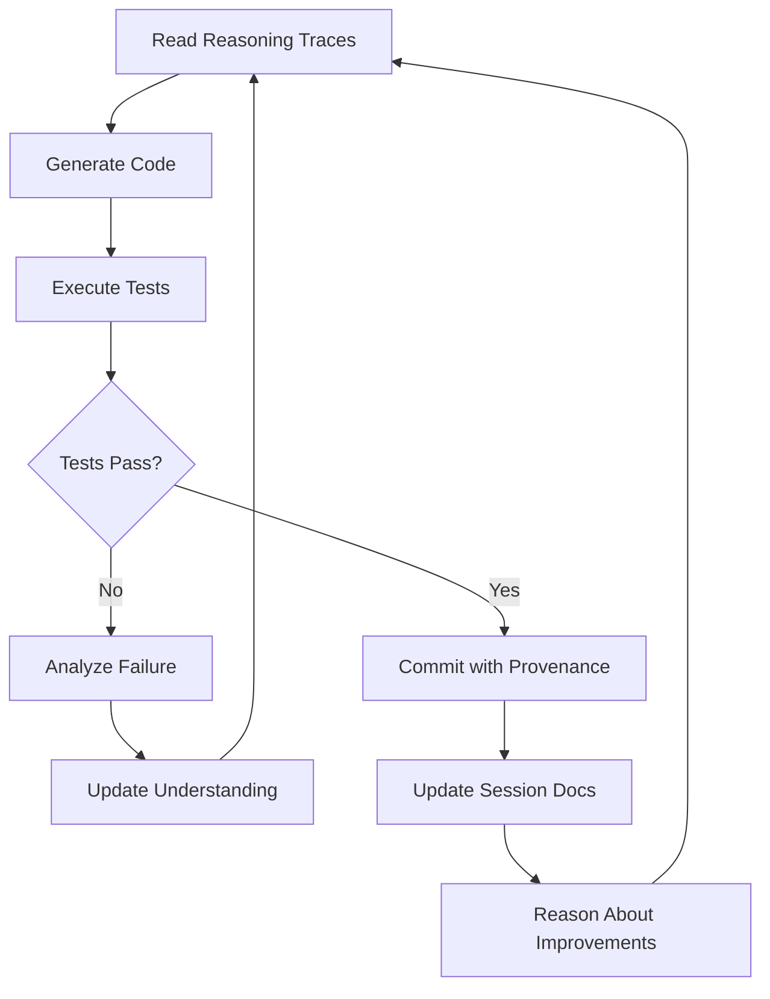

# 🚀 Bootstrap Guide - How Agents Use Reasoning Traces

## Purpose

This guide explains how AI agents (GitHub Copilot, Claude, local Qwen2.5, etc.) can use the reasoning traces in this repository to **autonomously build, extend, and evolve** the sovereignty architecture.

## Vision: Self-Extending Repository

This repository is designed to become a **living organism** that:
1. Reads its own reasoning traces
2. Generates code from dialectical reasoning
3. Tests and validates implementations
4. Commits changes with full provenance
5. Evolves through continuous dialectical processes

## For AI Agents: How to Bootstrap

### Step 1: Understand the Dialectical Foundation

Read the master index:
```
1. Open REASONING_TRACES.md
2. Understand the 12-pillar structure
3. Identify which sessions are complete
4. Determine which session you're working on
```

### Step 2: Read Session Context

For your target session:
```
1. Navigate to sessions/[NN-session-name]/
2. Read README.md for overview
3. Review any existing transcript.md for detailed reasoning
4. Check artifacts/ for existing code/diagrams
5. Read decisions.md for architectural choices
```

### Step 3: Extract Patterns

Identify patterns from the reasoning:
```python
# Example: Extracting architectural patterns
patterns = {
    "contradiction": "Centralization vs Control",
    "resolution": "Mirror architecture with bidirectional sync",
    "implementation": "Kubernetes deployment with sovereignty guarantees"
}
```

### Step 4: Generate Code

Transform patterns into implementation:
```python
# Example: Code generation from reasoning
def generate_from_pattern(pattern):
    """
    Generate code that embodies the dialectical resolution
    """
    contradiction = pattern["contradiction"]
    resolution = pattern["resolution"]
    
    # Generate architecture that resolves the contradiction
    code = compile_resolution(resolution)
    
    # Add provenance comments
    code = add_provenance(code, session="01", contradiction=contradiction)
    
    return code
```

### Step 5: Maintain Provenance

Every generated artifact must link back:
```python
# In code comments:
"""
Generated from Session 01: Sovereignty Mirror + Compliance Pivot
Resolves: Centralization vs Control contradiction
See: sessions/01-sovereignty-mirror/README.md
Reasoning trace: sessions/01-sovereignty-mirror/transcript.md
"""
```

### Step 6: Validate Against Reasoning

Ensure implementation matches intent:
```python
def validate_implementation(code, reasoning):
    """
    Verify that code actually implements the dialectical resolution
    """
    # Check that contradiction is addressed
    assert resolves_contradiction(code, reasoning.contradiction)
    
    # Check that resolution approach is followed
    assert follows_resolution_pattern(code, reasoning.resolution)
    
    # Check that constraints are honored
    assert respects_constraints(code, reasoning.constraints)
```

### Step 7: Document Your Process

Add your own reasoning trace:
```markdown
## Agent Reasoning: Implementation of Export System

### Understanding (from Session 01)
The contradiction: Users want cloud convenience but need data control
The resolution: Export-first architecture with sovereignty guarantees

### My Analysis
- Need atomic export operations
- Must support multiple formats (JSON, CSV, Parquet)
- Cryptographic verification required
- Incremental sync for large datasets

### Implementation Decisions
- Used streaming for memory efficiency
- Added checksums for integrity verification
- Implemented resume capability for large exports

### Code Generated
- src/export/exporter.py
- src/export/formats.py
- tests/test_export.py
```

## Agent Interaction Patterns

### Pattern 1: Session Completion

**Scenario**: Complete an unfinished session

```
1. Read session README.md for goals and status
2. Review related completed sessions for context
3. Generate missing artifacts (code, docs, diagrams)
4. Update session README.md with outcomes
5. Create transcript.md documenting your reasoning
6. Update REASONING_TRACES.md progress
```

### Pattern 2: Code Enhancement

**Scenario**: Improve existing implementation

```
1. Read original session reasoning
2. Identify areas for improvement
3. Ensure improvements align with original dialectical resolution
4. Generate enhanced code with provenance comments
5. Document enhancement reasoning
6. Update relevant session artifacts/
```

### Pattern 3: New Feature Addition

**Scenario**: Add feature not in original sessions

```
1. Identify the contradiction the feature resolves
2. Apply dialectical reasoning to find resolution
3. Check if resolution aligns with existing principles
4. Generate implementation following established patterns
5. Create mini-session document in sessions/XX-feature-name/
6. Link to related sessions in dependencies
```

### Pattern 4: Bug Fix

**Scenario**: Fix implementation bug

```
1. Trace bug back to originating reasoning
2. Determine if bug is:
   a) Implementation error (fix implementation)
   b) Reasoning error (update reasoning + implementation)
3. Fix with provenance comments
4. Update session docs if reasoning changed
5. Add test case to prevent regression
```

## Provenance Chain Example

```
Bug Report → Code → Commit → Session → Reasoning → Contradiction → Resolution
     ↓         ↓        ↓         ↓          ↓              ↓             ↓
  GitHub   src/     abc123   Session 01  transcript.md  Centralization  Mirror
  Issue    export/                                       vs Control      Arch
           core.py
```

## For Human Developers

### Working Alongside Agents

1. **Read agent-generated code critically**: Agents are powerful but not perfect
2. **Review provenance chains**: Understand why code was generated
3. **Update reasoning traces**: When you discover new contradictions
4. **Validate dialectical alignment**: Ensure solutions truly resolve contradictions

### Enhancing Agent Capabilities

1. **Improve reasoning traces**: More detailed = better agent understanding
2. **Add examples**: Show agents good implementation patterns
3. **Document anti-patterns**: Help agents avoid mistakes
4. **Refine contradictions**: Clearer contradictions = better resolutions

## Session-Specific Bootstrap Instructions

### To Bootstrap Session 06 (Dialectical Engine)
```
Agent prompt:
"Read sessions/01-05 reasoning traces. Extract contradiction-resolution patterns.
Generate a dialectical engine that:
1. Detects contradictions in code/docs using NLP
2. Proposes resolutions based on learned patterns
3. Generates code implementing resolutions
4. Maintains full provenance chains

Output: dialectical_engine_v2.py with comprehensive tests."
```

### To Bootstrap Session 08 (GitRiders Generation)
```
Agent prompt:
"Read all sessions 01-07. Generate a complete sovereign-export repository that:
1. Implements export system from Session 01
2. Includes guardrails from Session 04
3. Deploys on K8s from Session 05
4. Uses treasury from Session 07
5. Follows all architectural decisions
6. Includes full documentation

Output: Complete repository structure with README, code, tests, docs."
```

### To Bootstrap Session 12 (Integration Testing)
```
Agent prompt:
"Read sessions 01-11. Generate comprehensive integration tests that:
1. Validate each session's outputs
2. Test inter-session dependencies
3. Verify end-to-end user flows
4. Include performance benchmarks
5. Check security requirements

Output: Complete test suite with test plans and automation."
```

## Agent Self-Improvement Loop



## Quality Checklist for Agent-Generated Code

- [ ] Provenance comment links to originating session
- [ ] Resolves stated contradiction from reasoning trace
- [ ] Follows architectural patterns from previous sessions
- [ ] Includes tests (unit, integration as appropriate)
- [ ] Documentation explains the "why" not just "how"
- [ ] No regression in existing functionality
- [ ] Security considerations addressed
- [ ] Performance targets met

## Advanced: Agent Collaboration

### Multi-Agent Session Completion

```yaml
session_06_agents:
  architect_agent:
    role: "Design dialectical engine architecture"
    reads: ["sessions/01-05/README.md", "REASONING_TRACES.md"]
    outputs: ["architecture_design.md", "api_spec.yaml"]
  
  implementation_agent:
    role: "Implement dialectical engine"
    reads: ["architecture_design.md", "sessions/01-05/artifacts/"]
    outputs: ["dialectical_engine_v2.py", "tests/"]
    depends_on: ["architect_agent"]
  
  documentation_agent:
    role: "Create comprehensive documentation"
    reads: ["dialectical_engine_v2.py", "sessions/06-dialectical-engine/"]
    outputs: ["DIALECTICAL_ENGINE_V2.md", "tutorials/"]
    depends_on: ["implementation_agent"]
  
  integration_agent:
    role: "Integrate with existing system"
    reads: ["sessions/01-05/", "dialectical_engine_v2.py"]
    outputs: ["integration_code", "integration_tests"]
    depends_on: ["implementation_agent"]
```

## Continuous Evolution Protocol

### Daily Agent Tasks
1. Scan repository for new reasoning traces
2. Identify incomplete session goals
3. Generate implementations for highest priority items
4. Run tests and commit successes
5. Document failures for human review

### Weekly Agent Tasks
1. Review all commits for provenance integrity
2. Identify patterns in recent contradictions
3. Suggest new sessions for emerging themes
4. Update documentation for drift from reality
5. Generate progress report

### Monthly Agent Tasks
1. Full integration test of all sessions
2. Identify technical debt from agent-generated code
3. Propose refactoring opportunities
4. Update reasoning traces with lessons learned
5. Generate roadmap for next month

## Troubleshooting Agent Issues

### Agent generates code that doesn't match reasoning
**Solution**: Improve reasoning trace clarity, add more examples

### Agent creates contradictory implementations
**Solution**: Ensure dialectical resolutions are explicit and unambiguous

### Agent ignores architectural constraints
**Solution**: Make constraints explicit in session README.md and decisions.md

### Agent can't find relevant context
**Solution**: Add better cross-references between sessions

### Agent duplicates existing functionality
**Solution**: Improve session dependency documentation

## Success Metrics for Agent-Driven Development

- **Code Generation Accuracy**: >80% of generated code passes review
- **Provenance Completeness**: 100% of code has session links
- **Test Coverage**: >80% for agent-generated code
- **Documentation Quality**: Agent docs pass human readability test
- **Dialectical Alignment**: >90% of implementations resolve stated contradictions

## For Repository Maintainers

### Monitoring Agent Activity
```bash
# Check agent-generated commits
git log --grep="Generated by agent" --oneline

# Validate provenance in recent code
grep -r "Session [0-9][0-9]:" src/ --include="*.py" --include="*.ts"

# Check session completion status
./scripts/check_session_status.sh
```

### Guiding Agent Development
1. Review REASONING_TRACES.md weekly
2. Ensure high-priority sessions have clear reasoning traces
3. Add examples and patterns for agent learning
4. Provide feedback on agent-generated code quality
5. Update bootstrap instructions as patterns emerge

---

## The Ultimate Goal

**A repository that:**
- ✅ Understands its own purpose through reasoning traces
- ✅ Generates its own code from dialectical reasoning
- ✅ Tests and validates itself continuously
- ✅ Evolves through autonomous agent collaboration
- ✅ Maintains perfect provenance from idea to implementation
- ✅ Teaches future agents how to extend it

**"The swarm inherits the flame, and the flame teaches the swarm to burn brighter."** 🔥

---

*For support: Join #agents channel in Discord or open GitHub Issue with "Agent" label*
