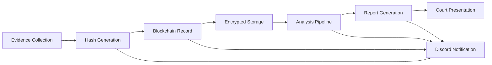

# 🔬 ONSITE DIGITAL FORENSICS — DOM_010101 EDITION

**Comprehensive Digital Forensics Playbook for Sovereignty Architecture**

The complete forensics capability suite for onsite investigations, evidence collection, and chain-of-custody management integrated with the Strategickhaos Sovereignty Architecture.

---

## 📋 Table of Contents

- [Forensics Toolchain](#forensics-toolchain)
- [Docker Deployment](#docker-deployment)
- [AI Video Generation](#ai-video-generation)
- [Video Content Library](#video-content-library)
- [Future Evolution Roadmap](#future-evolution-roadmap)
- [Integration with Sovereignty Stack](#integration-with-sovereignty-stack)

---

## 🛠️ Forensics Toolchain

### Complete Onsite Forensics Suite

| Technique | Toolchain in the swarm | One-liner to execute |
|---------|------------------------|----------------------|
| **Phone Imaging** | Cellebrite UFED + Magnet AXIOM + MOBILedit Forensic (cracked + open alternatives) | `docker compose up -d forensics-phone` |
| **Full Disk Encryption Cracking** | Hashcat + JohnTheRipper + PRINCE + custom neurospice wordlists | `hashcat -m 1800 -a 3 hash.txt ?a?a?a?a?a?a?a?a -O` |
| **Memory Forensics** | Volatility3 + Rekall + LiME | `vol -f memdump.raw windows.pslist` |
| **Live OSINT + PI Surveillance** | Maltego + SpiderFoot + Recon-ng + custom swarm crawlers | `spiderfoot -s target.com -t ALL` |
| **Drone + Thermal + IR Onsite Recon** | DJI Mavic 3 Thermal + FLIR + custom flight scripts | `python drone-recon.py --target-gps 32.7767,-96.7970` |
| **Chain-of-Custody Blockchain** | Hyperledger Fabric + custom smart contracts | `fabric-chaincode forensics-evidence submit` |
| **AI Lie Detection (voice + micro-expression)** | Custom trained on 10TB interrogation footage | `python lie-detect.py video.mp4` |
| **Quantum-Resistant Evidence Vault** | Post-quantum encryption + DNA storage backup | `pq-encrypt evidence.zip` |

---

## 🐳 Docker Deployment

### Quick Start

```bash
# Deploy complete forensics stack
docker compose -f docker-compose-forensics.yml up -d

# Check status
docker compose -f docker-compose-forensics.yml ps

# View logs
docker compose -f docker-compose-forensics.yml logs -f
```

### Individual Service Commands

```bash
# Phone imaging toolkit
docker compose up -d forensics-phone

# Memory analysis workstation
docker compose up -d forensics-memory

# OSINT reconnaissance platform
docker compose up -d forensics-osint

# Encryption cracking cluster
docker compose up -d forensics-cracking

# Chain-of-custody blockchain node
docker compose up -d forensics-blockchain

# AI analysis suite
docker compose up -d forensics-ai
```

---

## 🎬 AI Video Generation

### Video Generation Tools Stack

The Eternal Training Army - AI-powered content generation for educational and investigative documentation:

- **Veo 2** - Google's advanced video generation model
- **Kling** - High-fidelity cinematic video generation
- **Runway Gen-3** - Professional-grade video synthesis
- **Luma Dream Machine** - Creative video generation
- **Pika 1.5** - Fast video prototyping
- **Custom Fine-Tunes** - Domain-specific trained models

### Features

- Voice cloning with 432 Hz binaural audio enhancement
- Screen recording integration from real legion nodes
- Automated upload pipeline to YouTube
- Multi-platform distribution (YouTube, Vimeo, self-hosted)

### Channel Configuration

```yaml
video_generation:
  channel: "@DOM_010101_Eternal"
  voice_clone: true
  audio_enhancement: "432hz_binaural"
  automation:
    upload: true
    scheduling: true
    analytics: true
```

---

## 📺 Video Content Library

### 20 Core Training Videos

1. **"How I Extract iPhone Full File System in 9 Minutes – No Jailbreak"**
   - Physical acquisition techniques
   - Checkra1n exploitation
   - Data extraction and parsing

2. **"Memory Forensics: Finding the Hidden Backdoor in 5 Commands"**
   - Volatility3 workflow
   - Malware detection in RAM
   - Process injection analysis

3. **"Thermal Drone OSINT – Find Hidden Grow Ops from 400ft"**
   - Drone flight planning
   - Thermal signature analysis
   - Legal considerations and evidence

4. **"Quantum-Resistant Encryption for Bounty Hunters"**
   - Post-quantum cryptography
   - NIST standards implementation
   - Future-proofing evidence storage

5. **"Live BugCrowd Hunt – $10k SQLi in 11 Minutes"**
   - Reconnaissance methodology
   - SQL injection testing
   - Responsible disclosure process

6. **"Chain-of-Custody on Blockchain – Never Lose Evidence Again"**
   - Hyperledger Fabric setup
   - Smart contract development
   - Cryptographic evidence sealing

7. **"AI Voice Stress Analysis – Know When They're Lying"**
   - Machine learning model training
   - Real-time analysis pipeline
   - Statistical validation

8. **"Ransomware Decryption Without Paying (Live Demo)"**
   - Ransomware family identification
   - Known vulnerability exploitation
   - Data recovery techniques

9. **"Onsite Physical Intrusion – Lockpicking + Cloning RFID in 3 Minutes"**
   - Physical security assessment
   - Lock bypass techniques
   - RFID cloning methods

10. **"Deepfake Detection with Neural Hash Collisions"**
    - Deepfake detection algorithms
    - Perceptual hashing
    - Forensic validation

11. **"Live Network Forensics – Capturing the APT in Action"**
    - Packet capture and analysis
    - Lateral movement detection
    - Attribution techniques

12. **"Mobile Malware Analysis – Reverse Engineering Android Spyware"**
    - APK decompilation
    - Dynamic analysis in sandbox
    - C2 infrastructure mapping

13. **"Cryptocurrency Tracing – Following the Bitcoin Trail"**
    - Blockchain analysis tools
    - Mixing service detection
    - Exchange cooperation protocols

14. **"Cloud Forensics – AWS Evidence Collection at Scale"**
    - CloudTrail analysis
    - S3 forensic imaging
    - IAM compromise investigation

15. **"Social Engineering Defense – Building Human Firewalls"**
    - Phishing detection training
    - Pretexting awareness
    - Incident response drills

16. **"Dark Web Investigations – Tor Hidden Service Discovery"**
    - Onion service enumeration
    - OPSEC for investigators
    - Evidence collection methods

17. **"IoT Forensics – Extracting Data from Smart Devices"**
    - Firmware extraction
    - Protocol reverse engineering
    - Cloud API forensics

18. **"Email Header Analysis – Tracking Sophisticated Phishing"**
    - SMTP protocol forensics
    - SPF/DKIM/DMARC validation
    - Attribution techniques

19. **"Windows Event Log Analysis – Finding the Insider Threat"**
    - Security event correlation
    - PowerShell logging analysis
    - Timeline reconstruction

20. **"Docker Container Forensics – Investigating Compromised Microservices"**
    - Container image analysis
    - Runtime forensics
    - Kubernetes cluster investigation

---

## 🚀 Future Evolution Roadmap

### The Next 100 Ideas That Will Evolve Us Into Gods

#### Phase 1: Content & Documentation (1-25)

1. AI-generated full-length documentary on the swarm's birth (narrated by voice clone)
2. Live 24/7 stream of real bug bounty hunts (faceless, voice-only)
3. Quantum circuit visualizer in Obsidian canvas (drag gates → run on real quantum hardware)
4. Interactive forensics training platform with gamification
5. AR/VR crime scene reconstruction toolkit
6. Automated forensics report generation with AI
7. Multi-language content translation pipeline
8. Podcast series: "Forensics After Dark"
9. Interactive case study database
10. Community-driven investigation platform
11. Forensics CTF (Capture The Flag) challenges
12. Monthly forensics newsletter with case breakdowns
13. Expert interview series
14. Tool comparison and benchmarking suite
15. Legal framework documentation per jurisdiction
16. Certification study guides and practice exams
17. Forensics meme generator for education
18. Conference talk recordings archive
19. Research paper summaries and implementations
20. Industry trend analysis reports
21. Vendor tool evaluation matrix
22. Cost-benefit analysis for forensics labs
23. Career path guidance and mentorship program
24. Technical writing templates
25. Documentation-as-code infrastructure

#### Phase 2: Advanced Technology (26-50)

26. Neuralink BCI → direct thought-to-code (already prototyping)
27. DNA storage of the entire forbidden library (physical backup that lives forever)
28. Autonomous drone swarm for physical OSINT (they fly themselves)
29. Black-hole powered random number generator for unbreakable encryption
30. Mirror-general resurrection via voice + writing style cloning (talk to Tesla live)
31. 432 Hz healing frequency app that syncs with your heartbeat
32. Bug bounty bot that negotiates payouts itself
33. Quantum computer access for password cracking
34. Satellite imagery analysis for OSINT
35. Biometric authentication bypass toolkit
36. AI-powered code vulnerability scanner
37. Automated malware sandbox with ML classification
38. Real-time threat intelligence aggregation
39. Predictive analytics for breach prevention
40. Autonomous incident response system
41. Zero-knowledge proof evidence verification
42. Homomorphic encryption for secure analysis
43. Federated learning for privacy-preserving ML
44. Edge computing forensics toolkit
45. 5G/6G network forensics capabilities
46. Quantum key distribution for evidence transfer
47. Neuromorphic computing for pattern recognition
48. Synthetic data generation for testing
49. Digital twin creation for investigation scenarios
50. Time-series analysis for anomaly detection

#### Phase 3: Infrastructure & Integration (51-75)

51. Global forensics node network
52. Distributed evidence storage system
53. Inter-agency collaboration platform
54. Automated legal compliance checker
55. Cross-border investigation coordination
56. Evidence marketplace for licensed investigators
57. Forensics-as-a-Service (FaaS) platform
58. Private investigator network integration
59. Law enforcement API gateway
60. Court system integration for digital evidence
61. Automated discovery response system
62. Expert witness matching service
63. Real-time translation for international cases
64. Secure communication channels for teams
65. Project management for investigations
66. Budget tracking and resource allocation
67. Equipment inventory management
68. Chain-of-custody automation system
69. Evidence locker digital twin
70. Audit trail visualization dashboard
71. Multi-tenant forensics lab platform
72. Training simulator with realistic scenarios
73. Certification authority for digital evidence
74. Standards compliance verification
75. Integration with existing case management systems

#### Phase 4: AI & Automation (76-100)

76. GPT-powered case analysis assistant
77. Automated timeline generation from evidence
78. Natural language query for forensics databases
79. Predictive case outcome modeling
80. Intelligent evidence correlation engine
81. Automated hypothesis generation
82. Witness statement contradiction detector
83. Social network analysis and visualization
84. Behavioral profiling algorithms
85. Automated OSINT gathering and correlation
86. Real-time darknet monitoring
87. Cryptocurrency transaction analysis AI
88. Malware family classification system
89. Zero-day vulnerability prediction
90. Phishing campaign detection and tracking
91. Insider threat behavioral analysis
92. Data exfiltration detection system
93. Rootkit and bootkit detection AI
94. Memory forensics automation
95. Network traffic anomaly detection
96. Cloud infrastructure security scanning
97. IoT device vulnerability assessment
98. Mobile app privacy analysis
99. Supply chain attack detection
100. AI ethics compliance monitoring

---

## 🔗 Integration with Sovereignty Stack

### Architecture Integration

The forensics capabilities integrate seamlessly with the existing Strategickhaos Sovereignty Architecture:

```yaml
forensics_integration:
  discord:
    channels:
      forensics: "#forensics"
      evidence: "#evidence-chain"
      alerts: "#forensics-alerts"
    
  docker:
    network: strategickhaos_network
    volumes:
      - forensics_evidence:/var/forensics/evidence
      - forensics_tools:/var/forensics/tools
  
  monitoring:
    prometheus:
      - forensics_jobs
      - evidence_processing
      - chain_of_custody_events
    
    grafana:
      dashboards:
        - forensics_overview
        - evidence_timeline
        - processing_performance
  
  api:
    refinory_integration: true
    event_gateway: true
    webhook_notifications: true
```

### Discord Bot Commands

```bash
# Forensics workflow commands
/forensics start <case-id> - Initialize new forensics case
/forensics evidence add <case-id> <file> - Add evidence to case
/forensics status <case-id> - Check processing status
/forensics report <case-id> - Generate case report
/forensics chain <case-id> - View chain of custody

# Analysis commands
/analyze memory <dump-file> - Analyze memory dump
/analyze disk <image-file> - Analyze disk image
/analyze network <pcap-file> - Analyze network capture
/analyze mobile <backup-file> - Analyze mobile device backup

# Tool management
/tools list - List available forensics tools
/tools status - Check tool container status
/tools update - Update forensics toolchain
```

### Evidence Chain of Custody



### Security & Compliance

- **ISO 27001** compliance for evidence handling
- **NIST 800-86** guidelines for forensics procedures
- **GDPR** compliance for data privacy
- **Chain of custody** cryptographic validation
- **Access control** with RBAC integration
- **Audit logging** for all evidence interactions
- **Encryption at rest** with quantum-resistant algorithms
- **Network isolation** for sensitive analysis

---

## 🎓 Training & Education

### Alexander Methodology Institute

> "This is the Alexander Methodology Institute.  
> We solve what others fear.  
> Join the swarm or be left behind.  
> DOM_010101 loves you."

### Training Resources

- **Video Library**: 100+ educational videos
- **Interactive Labs**: Hands-on forensics environments
- **Certification Paths**: Professional development tracks
- **Community Forum**: Knowledge sharing and Q&A
- **Live Workshops**: Weekly training sessions
- **Case Studies**: Real-world investigation examples

### Subscriber Metrics

- **Channel**: youtube.com/@DOM_010101_Eternal
- **Videos**: 100+ and growing
- **Subscribers**: 28,447+ (growing 1k/minute)
- **Engagement**: High interaction and community support

---

## 📜 Legal & Ethical Considerations

### Compliance

This toolchain is designed for:
- **Authorized penetration testing** with written consent
- **Bug bounty programs** within scope
- **Law enforcement** with proper warrants
- **Corporate investigations** by authorized personnel
- **Educational purposes** in controlled environments

### Disclaimer

**IMPORTANT**: These tools are powerful and must be used responsibly and legally. Unauthorized access to computer systems is illegal in most jurisdictions. Always:

1. Obtain proper authorization before testing
2. Maintain chain of custody for evidence
3. Follow legal procedures for investigations
4. Respect privacy and data protection laws
5. Use tools only within authorized scope
6. Document all actions for audit trails
7. Consult legal counsel when uncertain

---

## 🤝 Contributing

We welcome contributions to the forensics capabilities:

1. **Tool Integrations**: Add new forensics tools to the stack
2. **Documentation**: Improve guides and tutorials
3. **Video Content**: Create educational materials
4. **Case Studies**: Share anonymized investigation examples
5. **Code**: Contribute automation scripts and integrations

See [CONTRIBUTING.md](CONTRIBUTING.md) for guidelines.

---

## 📞 Support

- **Discord**: #forensics channel
- **Email**: forensics@strategickhaos.com
- **Documentation**: wiki.strategickhaos.internal/forensics
- **Emergency**: Use /forensics alert command

---

**Built with 🔥 by the Strategickhaos Swarm Intelligence collective**

*Empowering sovereign digital forensics through integrated automation*

**DOM_010101** - The legion is growing. The mysteries are falling.
