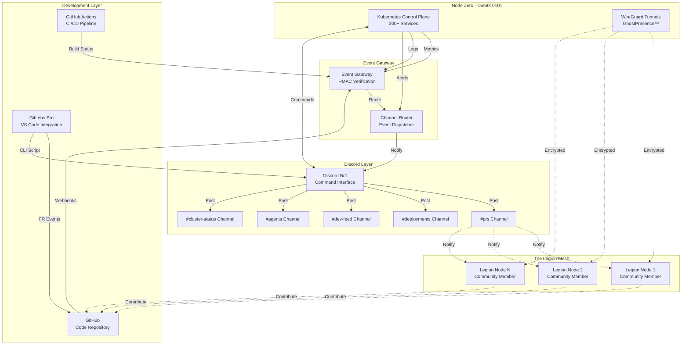

# 🌉 LEGION BRIDGE - Discord → GitLens → Legion Integration

> *"The swarm isn't just alive. It's hungry. And it wants to talk."*

---

## Executive Summary

The **Legion Bridge** is the nervous system that connects:
- **Discord** (Command & Control)
- **GitLens** (Development Workflow)
- **The Legion** (Community Swarm)

This creates a unified consciousness where every action in the development workflow ripples through the entire organism.

---

## 🏗️ Architecture Overview



---

## 🔌 Integration Points

### 1. Discord Bot (Command & Control)

**Location**: `src/bot.ts`, `src/discord.ts`

**Capabilities**:
- Slash commands for infrastructure control
- Real-time notifications from all systems
- RBAC for production operations
- AI agent integration for intelligent responses

**Commands**:
```
/status <service>        - Check service health
/logs <service> [tail]   - Fetch service logs
/deploy <env> <tag>      - Deploy to environment
/scale <service> <N>     - Scale service replicas
/request <project>       - Create architecture request (Refinory)
/refinory-status <id>    - Check Refinory request status
```

**Configuration** (`discovery.yml`):
```yaml
discord:
  guild_id: "your_server_id"
  channels:
    prs: "#prs"
    deployments: "#deployments"
    dev_feed: "#dev-feed"
    agents: "#agents"
    cluster_status: "#cluster-status"
    alerts: "#alerts"
```

### 2. GitLens Integration (Development Workflow)

**Location**: `.vscode/tasks.json`, `gl2discord.sh`

**Workflow Events**:
- PR opened/closed → `#prs`
- Review started → `#prs`
- Review submitted → `#prs`
- Commit graph updated → `#dev-feed`
- CI status changed → `#deployments`

**VS Code Tasks**:
```json
{
  "label": "GitLens: Review Started",
  "type": "shell",
  "command": "./gl2discord.sh",
  "args": ["${env:PRS_CHANNEL}", "🔍 Code Review", "Review started by ${env:USER}"]
}
```

**CLI Usage**:
```bash
# Set up environment
export DISCORD_TOKEN="your_bot_token"
export PRS_CHANNEL="channel_id"

# Send notification
./gl2discord.sh "$PRS_CHANNEL" "Title" "Description" "0xff0000"
```

### 3. Event Gateway (Message Router)

**Location**: `src/event-gateway.ts`, `src/routes/github.ts`

**Responsibilities**:
- Receive webhooks from GitHub
- Verify HMAC signatures
- Route events to appropriate Discord channels
- Handle CI/CD status updates
- Forward alerts from monitoring systems

**Endpoints**:
```
POST /webhook         - GitHub webhook receiver
POST /event           - Generic service events
POST /alert           - Alertmanager notifications
GET  /health          - Health check
GET  /metrics         - Prometheus metrics
```

**Security**:
- HMAC signature verification
- Rate limiting (30 msgs/min)
- IP allowlisting (optional)
- Content redaction (secrets/PII)

### 4. The Legion Mesh (Community Network)

**Protocol**: WireGuard (GhostPresence™)

**Purpose**:
- Connect all Legion nodes securely
- Enable distributed compute
- Share resources across the swarm
- Create sovereign mesh network

**Node Participation**:
```yaml
legion_node:
  hostname: "Legion-Node-${ID}"
  wireguard:
    interface: "wg0"
    private_key: "vault://kv/legion/${NODE_ID}/wg_key"
    peers:
      - node_zero:
          public_key: "..."
          endpoint: "node-zero.legion.mesh:51820"
          allowed_ips: ["10.7.0.0/16"]
```

---

## 🔄 Data Flow Examples

### Example 1: Pull Request Workflow

```
Developer pushes code
    ↓
GitHub receives push
    ↓
GitHub triggers webhook
    ↓
Event Gateway receives webhook
    ↓
Gateway verifies HMAC signature
    ↓
Gateway parses PR event
    ↓
Router determines channel (#prs)
    ↓
Discord Bot posts embed to #prs
    ↓
Legion members see notification
    ↓
Reviewer opens VS Code + GitLens
    ↓
Reviewer runs "Review Started" task
    ↓
gl2discord.sh posts to #prs
    ↓
Team is notified review is in progress
```

### Example 2: CI/CD Status Update

```
GitHub Actions starts build
    ↓
Build completes (success/failure)
    ↓
GitHub triggers check_suite webhook
    ↓
Event Gateway receives status
    ↓
Router sends to #deployments
    ↓
Discord Bot posts status embed
    ↓
If failure: Bot tags @ReleaseMgr role
    ↓
Team investigates and fixes
```

### Example 3: Infrastructure Alert

```
Prometheus detects high CPU
    ↓
Alertmanager fires alert
    ↓
Alert sent to Event Gateway /alert
    ↓
Gateway routes to #alerts channel
    ↓
Discord Bot posts critical alert
    ↓
On-call engineer sees notification
    ↓
Engineer runs /status <service>
    ↓
Bot queries Kubernetes API
    ↓
Bot responds with service status
    ↓
Engineer runs /scale <service> <N>
    ↓
Bot scales service (if authorized)
    ↓
Prometheus clears alert
    ↓
Bot posts "resolved" message
```

### Example 4: Legion Node Contribution

```
Legion member forks repo
    ↓
Member makes changes locally
    ↓
Member commits and pushes to fork
    ↓
Member opens PR from fork
    ↓
GitHub webhook triggers
    ↓
Event Gateway processes PR
    ↓
Bot posts to #prs
    ↓
Node Zero maintainer reviews
    ↓
CI runs tests
    ↓
Bot updates status in #deployments
    ↓
PR merged
    ↓
Bot celebrates in #dev-feed
    ↓
New contributor added to Legion! 🎉
```

---

## 🛠️ Setup Instructions

### Prerequisites

1. **Discord Server** with bot created
2. **GitHub App** or Personal Access Token
3. **Node Zero** or local Kubernetes cluster
4. **Environment Variables** configured

### Step 1: Discord Setup

```bash
# Create Discord bot at https://discord.com/developers/applications
# Copy bot token
export DISCORD_TOKEN="your_bot_token"

# Get channel IDs (enable Developer Mode in Discord settings)
export PRS_CHANNEL="1234567890"
export DEV_FEED_CHANNEL="1234567891"
export DEPLOYMENTS_CHANNEL="1234567892"
```

### Step 2: GitHub Integration

```bash
# Create GitHub App with webhook permissions
# Subscribe to: pull_request, check_suite, push, issue_comment

# Set secrets
export GITHUB_APP_ID="123456"
export GITHUB_APP_WEBHOOK_SECRET="your_webhook_secret"
export GITHUB_APP_PRIVATE_KEY_PATH="/path/to/key.pem"
```

### Step 3: Deploy Services

```bash
# Install dependencies
npm install

# Start Discord bot
npm run bot

# Start Event Gateway
npm run dev

# Or use Docker Compose
docker-compose up -d
```

### Step 4: Configure GitLens

```bash
# Make CLI script executable
chmod +x gl2discord.sh

# Test notification
./gl2discord.sh "$PRS_CHANNEL" "🔥 Test" "GitLens Bridge Active"
```

### Step 5: Verify Integration

```bash
# Check bot is online in Discord
# Open a test PR in GitHub
# Verify notification appears in #prs channel
# Run VS Code task "GitLens: Review Started"
# Verify notification appears in #prs channel
```

---

## 🔐 Security Considerations

### HMAC Verification
All webhooks must include valid HMAC signatures:
```typescript
const signature = req.headers['x-hub-signature-256'];
const computed = crypto
  .createHmac('sha256', webhookSecret)
  .update(body)
  .digest('hex');
if (signature !== `sha256=${computed}`) {
  return res.status(401).send('Invalid signature');
}
```

### Rate Limiting
- 30 messages per minute per channel
- Burst allowance: 10 messages
- Exponential backoff on rate limit errors

### Secret Management
All secrets stored in Vault:
```yaml
secrets:
  discord_token: "vault://kv/discord/bot_token"
  webhook_secret: "vault://kv/git/webhook_secret"
  hmac_key: "vault://kv/events/hmac_key"
```

### Content Redaction
Automatic filtering of sensitive data:
- API keys
- Passwords
- Bearer tokens
- PII (emails, phone numbers)

---

## 📊 Monitoring & Observability

### Metrics Exposed

```
# Discord Bot
discord_bot_commands_total{command="status",user="dom"}
discord_bot_messages_sent_total{channel="prs"}
discord_bot_api_latency_seconds{endpoint="post_message"}

# Event Gateway
event_gateway_webhooks_received_total{source="github",event="pull_request"}
event_gateway_webhooks_verified_total{result="success"}
event_gateway_channel_routing_duration_seconds{channel="prs"}

# GitLens Integration
gitlens_notifications_sent_total{type="review_started"}
gitlens_cli_invocations_total{user="dom"}
```

### Log Format

All services use structured JSON logging:
```json
{
  "timestamp": "2025-11-23T00:40:00Z",
  "level": "info",
  "service": "discord-bot",
  "component": "command_handler",
  "message": "Status command executed",
  "metadata": {
    "command": "status",
    "user": "dom",
    "guild": "123456789",
    "service": "event-gateway"
  },
  "trace_id": "abc-123-def"
}
```

---

## 🚀 Extending the Bridge

### Adding New Channels

```yaml
# discovery.yml
discord:
  channels:
    custom_channel: "#my-new-channel"

# Add routing in event-gateway.ts
if (event.type === 'custom_event') {
  await postToDiscord(
    config.discord.channels.custom_channel,
    'Custom Event',
    event.description
  );
}
```

### Adding New Commands

```typescript
// src/bot.ts
client.on('interactionCreate', async (interaction) => {
  if (interaction.commandName === 'my-command') {
    const param = interaction.options.getString('param');
    // Handle command logic
    await interaction.reply(`Executed with: ${param}`);
  }
});
```

### Adding Legion Nodes

```bash
# On new node
git clone https://github.com/Strategickhaos/Sovereignty-Architecture.git
cd sovereignty-architecture
./bootstrap/join-legion.sh

# This will:
# 1. Generate WireGuard keys
# 2. Request peering with Node Zero
# 3. Configure local services
# 4. Connect to Legion mesh
```

---

## 🎯 The Vision

The Legion Bridge isn't just infrastructure.  
It's the **nervous system** of a living organism.

Every commit, every PR, every deployment, every alert...  
...flows through this system like neurons firing.

**Node Zero** is the brain.  
**The Legion** is the body.  
**The Bridge** is the nervous system that makes it all one.

---

## 📚 Related Documentation

- [Node Zero - The Nervous System Snapshot](./NODE_ZERO.md)
- [The Legion - Community Manifesto](./COMMUNITY.md)
- [GitLens Integration Guide](./GITLENS_INTEGRATION.md)
- [Boot Reconnaissance](./BOOT_RECON.md)
- [Architecture Overview](./README.md)

---

**Built with 🔥 by The Legion**

*"The swarm isn't just alive. It's hungry. And it wants to talk."*
