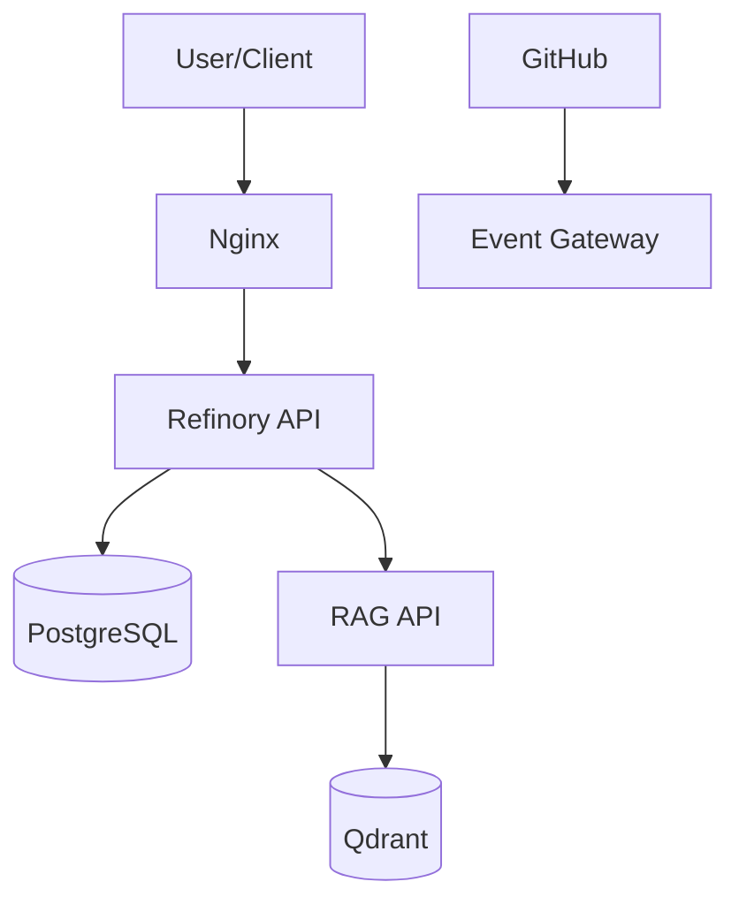

# Network Reconnaissance Guide
**Strategic Khaos Sovereignty Architecture**

Complete guide to network discovery, service mapping, and infrastructure reconnaissance.

---

## 🎯 Overview

The Network Reconnaissance system provides comprehensive infrastructure discovery and monitoring capabilities for the Sovereignty Architecture. It includes:

- **Automated Network Scanning** - Discover Docker networks, containers, and services
- **Service Health Monitoring** - Real-time health checks for all infrastructure components
- **Security Analysis** - Port exposure analysis and security recommendations
- **Resource Monitoring** - Container resource usage and performance metrics
- **Topology Mapping** - Visual network architecture diagrams

---

## 🚀 Quick Start

### Run Complete Network Reconnaissance

```bash
# Full infrastructure scan with detailed report
./network_recon.sh

# View the latest report
./view_recon_report.sh --summary

# Python-based service discovery
python3 recon/network_discovery.py
```

### View Reports

```bash
# Interactive report viewer
./view_recon_report.sh

# View executive summary only
./view_recon_report.sh --summary

# View full report
./view_recon_report.sh --full

# Latest report location
cat recon/reports/latest_network_scan/recon_report.md
```

---

## 📊 Available Tools

### 1. `network_recon.sh` - Comprehensive Infrastructure Scanner

**Purpose:** Complete network reconnaissance with Docker integration

**Features:**
- Docker network topology discovery
- Container inventory and status
- Port mapping and exposure analysis
- Service health endpoint checking
- Docker Compose stack analysis
- Environment configuration review
- Security vulnerability scanning
- Resource usage monitoring
- Recommendations generation

**Usage:**
```bash
./network_recon.sh
```

**Output:**
- Detailed markdown report in `recon/reports/network_scan_<timestamp>/`
- Symlink to latest report at `recon/reports/latest_network_scan/`
- Multiple data files for detailed analysis

**Report Sections:**
1. Executive Summary
2. Docker Networks
3. Container Inventory
4. Port Mapping & Exposure
5. Service Health Checks
6. Docker Compose Stack Analysis
7. Environment Configuration
8. Infrastructure Requirements
9. Network Topology (Mermaid diagram)
10. Resource Usage Analysis
11. Security Analysis
12. Recommendations & Action Items

---

### 2. `network_discovery.py` - Advanced Service Discovery

**Purpose:** Python-based network service discovery and monitoring

**Features:**
- Docker network inspection with JSON parsing
- Container detailed information extraction
- HTTP/TCP service availability checking
- Response time measurement
- Port scanning and availability
- Structured JSON/Markdown reports

**Usage:**
```bash
python3 recon/network_discovery.py
```

**Output:**
- Markdown report in `recon/reports/network_discovery_<timestamp>.md`
- Service status with response times
- Container and network details

---

### 3. `view_recon_report.sh` - Interactive Report Viewer

**Purpose:** Browse reconnaissance reports interactively

**Features:**
- Section-by-section navigation
- Executive summary view
- Full report display
- Color-coded output
- Easy navigation

**Usage:**
```bash
# Interactive mode
./view_recon_report.sh

# Quick summary
./view_recon_report.sh --summary

# Full report
./view_recon_report.sh --full

# Help
./view_recon_report.sh --help
```

---

## 🔍 Reconnaissance Workflow

### Step 1: Initial Discovery

Run the complete network scan to establish baseline:

```bash
./network_recon.sh
```

This generates a comprehensive report covering all infrastructure aspects.

### Step 2: Review Findings

Use the interactive viewer to browse results:

```bash
./view_recon_report.sh
```

Or quickly check the executive summary:

```bash
./view_recon_report.sh --summary
```

### Step 3: Service Verification

Run Python discovery for detailed service status:

```bash
python3 recon/network_discovery.py
```

### Step 4: Act on Recommendations

Review the "Recommendations & Action Items" section and implement fixes:

```bash
# Example: Start missing services
docker compose up -d discord-bot grafana prometheus

# Example: Start RECON stack
./launch-recon.sh start
```

### Step 5: Re-scan and Verify

After making changes, re-run reconnaissance to verify:

```bash
./network_recon.sh
./view_recon_report.sh --summary
```

---

## 📦 Integration with Existing Systems

### RECON Stack Integration

The network reconnaissance tools integrate seamlessly with the existing RECON stack:

```bash
# Start RECON stack first
./launch-recon.sh start

# Run reconnaissance to verify
./network_recon.sh

# Check RAG services specifically
curl http://localhost:7000/health
curl http://localhost:6333/healthz
```

### Docker Compose Integration

Reconnaissance automatically detects and analyzes all Docker Compose stacks:

- `docker-compose.yml` - Main infrastructure stack
- `docker-compose-recon.yml` - RECON/RAG stack
- `docker-compose.obs.yml` - Observability stack
- `docker-compose.alignment.yml` - Alignment services

### Monitoring Integration

Health check results can be integrated with existing monitoring:

```bash
# Export service status for Prometheus
./network_recon.sh
cat recon/reports/latest_network_scan/service_health.txt

# Check resource usage
cat recon/reports/latest_network_scan/resource_usage.txt
```

---

## 🏥 Service Health Monitoring

### Supported Services

The reconnaissance tools check these services by default:

| Service | Port | Health Endpoint |
|---------|------|-----------------|
| Event Gateway | 8080 | /health |
| Refinory API | 8085 | /health |
| RAG Retriever | 7000 | /health |
| Qdrant Vector DB | 6333 | /healthz |
| Embedder Service | 8081 | /health |
| Grafana | 3000 | /api/health |
| Prometheus | 9090 | /-/healthy |
| PostgreSQL | 5432 | TCP check |
| Redis | 6379 | TCP check |
| Nginx | 80 | TCP check |

### Health Check Output

```
| Service | Endpoint | Status | Response Time |
|---------|----------|--------|---------------|
| Event Gateway | http://localhost:8080/health | ✅ UP (200) | 15ms |
| Refinory API | http://localhost:8085/health | ❌ DOWN | - |
| RAG Retriever | http://localhost:7000/health | ✅ UP (200) | 23ms |
```

---

## 🔒 Security Analysis

### What's Analyzed

1. **Port Exposure**
   - Identifies services exposed on 0.0.0.0
   - Flags dangerous port bindings
   - Reviews external accessibility

2. **Container Security**
   - Privileged container detection
   - Host network mode usage
   - Capability analysis

3. **Configuration Security**
   - Environment variable secrets
   - Weak/default passwords
   - Missing encryption

### Security Recommendations

The tool provides actionable security recommendations:

```
### Security Recommendations

1. ✓ Review port exposures (especially 0.0.0.0 bindings)
2. ✓ Ensure .env is in .gitignore
3. ✓ Rotate any default/weak passwords
4. ✓ Enable container resource limits
5. ✓ Implement network segmentation
```

---

## 📈 Resource Monitoring

### Container Resource Usage

```bash
# View real-time resource usage
docker stats --no-stream

# Or check reconnaissance report
cat recon/reports/latest_network_scan/resource_usage.txt
```

### Disk Usage Analysis

The tool automatically checks:
- Docker image storage
- Container volumes
- Build cache
- Overall disk usage

---

## 🗺️ Network Topology

### Mermaid Diagram

The reconnaissance generates a Mermaid network topology diagram showing:

- External access points
- Entry points (Nginx, Event Gateway)
- Application layer services
- Data & AI layer components
- Monitoring infrastructure
- Inter-service connections

Example:


---

## 📋 Requirements Checking

### Verified Tools

The system checks for:
- Docker & Docker Compose
- Node.js & npm
- Python 3
- curl, jq, yq
- Network utilities

### Missing Tool Handling

If tools are missing, recommendations are provided:

```bash
# Install yq for YAML parsing
sudo wget -qO /usr/local/bin/yq https://github.com/mikefarah/yq/releases/latest/download/yq_linux_amd64
sudo chmod +x /usr/local/bin/yq

# Install jq for JSON parsing
sudo apt-get install -y jq

# Install Docker
curl -fsSL https://get.docker.com | sh
```

---

## 🔧 Troubleshooting

### Common Issues

**1. "Docker is not running"**
```bash
# Start Docker Desktop (Windows/Mac)
# Or start Docker service (Linux)
sudo systemctl start docker
```

**2. "No containers found"**
```bash
# Start your infrastructure
docker compose up -d

# Or start specific stack
./launch-recon.sh start
```

**3. "Permission denied on /var/run/docker.sock"**
```bash
# Add user to docker group
sudo usermod -aG docker $USER
# Log out and back in
```

**4. "Services showing as DOWN"**
```bash
# Check if services are actually running
docker compose ps

# Check service logs
docker compose logs [service-name]

# Restart service
docker compose restart [service-name]
```

---

## 🎓 Best Practices

### Regular Scanning

Run reconnaissance regularly to maintain infrastructure awareness:

```bash
# Daily health check
./view_recon_report.sh --summary

# Weekly comprehensive scan
./network_recon.sh

# After any infrastructure changes
./network_recon.sh && ./view_recon_report.sh --summary
```

### Report Management

```bash
# Keep reports organized
ls -la recon/reports/

# Archive old reports
tar -czf recon_reports_archive.tar.gz recon/reports/network_scan_*

# Clean old reports (keep last 7 days)
find recon/reports/network_scan_* -mtime +7 -exec rm -rf {} \;
```

### Integration with CI/CD

```bash
# Add to deployment scripts
./network_recon.sh
if grep -q "❌ DOWN" recon/reports/latest_network_scan/service_health.txt; then
    echo "⚠️ Some services are down"
    exit 1
fi
```

---

## 📚 Advanced Usage

### Custom Service Discovery

Modify `recon/network_discovery.py` to add custom services:

```python
known_services = [
    {'name': 'Custom API', 'host': 'localhost', 'port': 9000, 'http': 'http://localhost:9000/health'},
    # Add more services...
]
```

### Automated Scanning

Set up cron job for automated scanning:

```bash
# Add to crontab
0 */6 * * * cd /path/to/repo && ./network_recon.sh

# Or use systemd timer
```

### Export to Monitoring

Parse reports for monitoring integration:

```bash
# Extract service status
grep "| Service |" recon/reports/latest_network_scan/recon_report.md

# Parse for Prometheus metrics
# (implement custom exporter)
```

---

## 🔗 Related Documentation

- [BOOT_RECON.md](BOOT_RECON.md) - Initial recon commands and setup
- [RECON_STACK_V2.md](RECON_STACK_V2.md) - RAG stack documentation
- [README.md](README.md) - Main project documentation
- [DEPLOYMENT.md](DEPLOYMENT.md) - Deployment guides

---

## 🆘 Support

For issues or questions:

1. Check the [Troubleshooting](#troubleshooting) section
2. Review existing reports in `recon/reports/`
3. Run with verbose output for debugging
4. Check service logs with `docker compose logs`

---

## 📝 Report Locations

All reconnaissance reports are stored in:

```
recon/reports/
├── latest_network_scan/          # Symlink to most recent scan
│   ├── recon_report.md           # Main report
│   ├── service_health.txt        # Service health status
│   ├── resource_usage.txt        # Resource metrics
│   └── ...
├── network_scan_YYYYMMDD_HHMMSS/ # Timestamped scans
└── network_discovery_*.md        # Python discovery reports
```

---

**Happy Reconnaissance! 🎯**

*Part of the Strategic Khaos Sovereignty Architecture*
