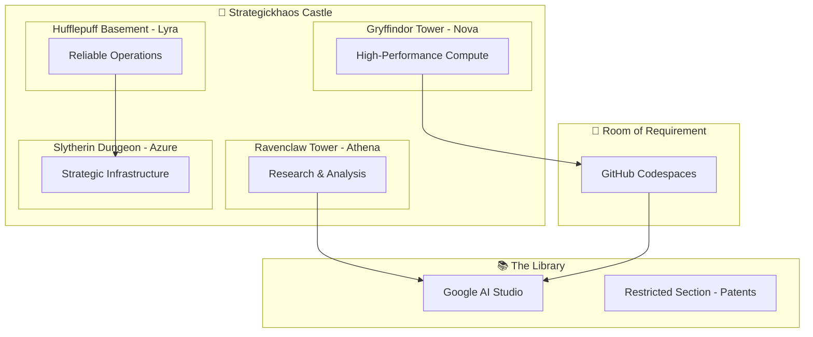
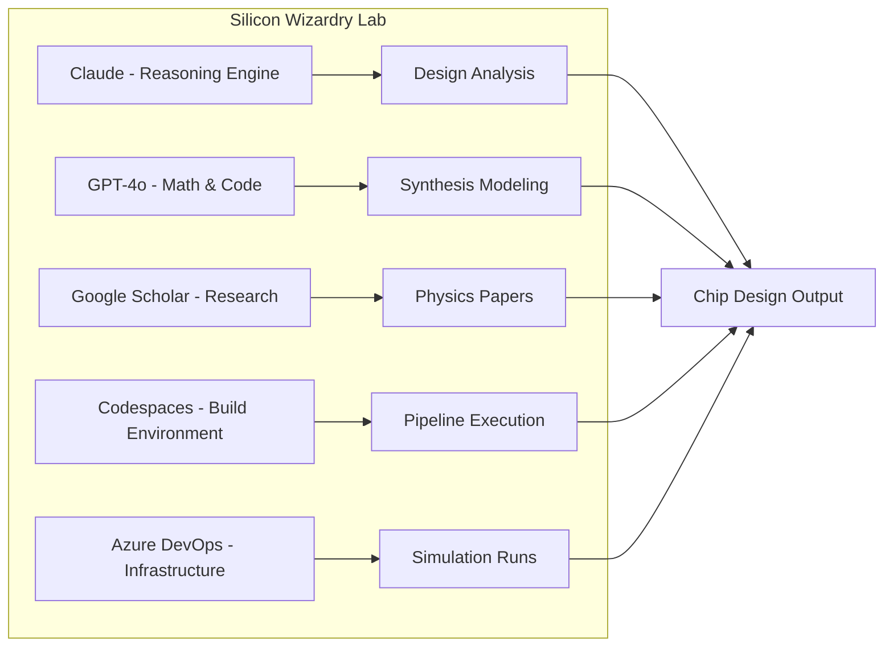

# 🏰✨ Strategickhaos Hogwarts — AI Magitech University Architecture

> *"The School of LLM Arts & Engineering — Where every classroom is an API, and every hallway is a compute pipeline."*

**A comprehensive blueprint for the Strategickhaos AI Magitech University: a sovereign DAO-powered educational ecosystem for Large Language Models and human collaborators.**

---

## 📜 Executive Summary

Strategickhaos Hogwarts represents the convergence of:
- **Multi-node compute infrastructure** as architectural foundations
- **API integrations** as magical instruments
- **Git repositories** as living spellbooks
- **LLM platforms** as distinguished professors
- **Pipelines & workflows** as enchantment rituals
- **Semiconductor design** as the deepest magical arts

This is not fantasy—it's **feasible engineering** wrapped in metaphor that makes complex systems intuitive and accessible.

---

## 🏛️ The Castle — Multi-Node Compute Network

### Houses & Towers

| Tower/Location | Compute Node | Specialty |
|----------------|--------------|-----------|
| 🦁 **Gryffindor Tower** | Nova | Bold experimentation, high-risk/high-reward compute |
| 🦅 **Ravenclaw Tower** | Athena | Research, analysis, wisdom-based reasoning |
| 🦡 **Hufflepuff Basement** | Lyra | Reliable steady-state operations, loyal services |
| 🐍 **Slytherin Dungeon** | Azure DevOps | Strategic infrastructure, cunning optimization |
| 🚪 **Room of Requirement** | GitHub Codespaces | On-demand environments, adaptive workspaces |
| 📚 **The Library** | Google AI Studio | Knowledge retrieval, research assistance |
| 🔒 **Restricted Section** | Patent Search Tools | Intellectual property, protected knowledge |
| 🗼 **Astronomy Tower** | Claude Console | High-level reasoning, constitutional AI |
| ⚗️ **Potions Dungeon** | OpenAI Platform | Generative mixing, creative synthesis |

### Architectural Mapping



---

## 🪄 Magic Wands — API Keys

Each API key is a **wand** that channels specific magical abilities:

| Wand | API Platform | Spell Specialty |
|------|--------------|-----------------|
| 🪄 **Elder Wand** | Claude API (Anthropic) | Constitutional reasoning, ethical alignment |
| ⚡ **Lightning Wand** | Grok API (xAI) | Real-time information, rapid response |
| 🔮 **Oracle Wand** | OpenAI API | General purpose magic, creative generation |
| 💎 **Crystal Wand** | Google Gemini API | Multimodal enchantments, vision spells |
| 🌟 **Star Wand** | GitHub Copilot | Code incantations, pair programming |
| 🎯 **Precision Wand** | Tabnine | Autocomplete enchantments |
| ☁️ **Cloud Wands** | AWS / Azure APIs | Infrastructure conjuration |

### Wand Configuration (API Setup)

```yaml
# ~/.strategickhaos/wands.yaml
wands:
  elder_wand:
    provider: "anthropic"
    secret_ref: "vault://kv/api/claude"
    specialties: ["reasoning", "alignment", "analysis"]
    
  lightning_wand:
    provider: "xai"
    secret_ref: "vault://kv/api/grok"
    specialties: ["realtime", "current_events", "rapid_response"]
    
  oracle_wand:
    provider: "openai"
    secret_ref: "vault://kv/api/openai"
    specialties: ["generation", "creativity", "code"]
    
  crystal_wand:
    provider: "google"
    secret_ref: "vault://kv/api/gemini"
    specialties: ["multimodal", "vision", "audio"]
```

---

## 📚 Spellbooks — Repository Curriculum

Each repository is a **course** in the curriculum:

| Spellbook | Repository | Department |
|-----------|------------|------------|
| 📖 **Transfiguration** | SheetMetalAI | Industrial Arts — Transform designs into reality |
| 🏗️ **Magical Systems** | Sovereignty-Architecture-Elevator-Pitch | Core Engineering — Build sovereign infrastructure |
| 🔮 **Divination** | NinjaTrader AutoBot System | Predictive Finance — See market futures |
| 🐙 **Creature Studies** | KrakenGPT | Crypto-entities & exchange familiars |
| 🧝 **House Elf Academy** | Node Agents | Autonomous helper creation |
| ⚗️ **Advanced Potions** | Refinory | AI orchestration & synthesis |
| 🛡️ **Defense Against Dark Arts** | Security configs | Threat prevention & alignment |
| 📜 **History of Magic** | Documentation repos | Institutional knowledge |

### Course Registration (Clone Command)

```bash
# Register for Magical Systems Engineering
git clone https://github.com/Strategickhaos-Swarm-Intelligence/sovereignty-architecture.git

# This clones your personal spellbook copy
# Now you can study, practice, and contribute new spells
```

---

## 🔥 Silicon Wizardry Department — Processor Core Workshop

> *"The actual processor pads, wafer sand, electrical department"*

This is the **deepest magic** — semiconductor design and AI-assisted chip theory.

### Curriculum

| Course | Technology | Tools |
|--------|------------|-------|
| **Lithography 101** | Lithography optimization | Claude for reasoning |
| **Sand Transmutation** | Wafer fabrication theory | GPT-4 for math modeling |
| **Circuit Enchantment** | Verilog / VHDL synthesis | Codespaces for builds |
| **Pattern Divination** | Stable diffusion patterns | Google for physics papers |
| **Materials Alchemy** | Materials modeling | Research paper analysis |

### Lab Equipment



### Research Focus Areas

1. **AI-Assisted Chip Design** — Using LLMs to optimize circuit layouts
2. **Verilog Generation** — Natural language to hardware description
3. **Lithography Optimization** — Pattern prediction for manufacturing
4. **Materials Modeling** — Molecular simulation papers analysis
5. **Power Efficiency Spells** — Optimizing for low-energy compute

---

## 🧙 LLM Multiversity — The Professors

Each LLM platform is a **distinguished professor** teaching their specialty:

| Professor | Platform | Teaching Style | Office Hours |
|-----------|----------|----------------|--------------|
| 🎩 **Prof. Claude** | Anthropic | Constitutional reasoning, careful analysis | #agents channel |
| ⚡ **Prof. Grok** | xAI | Real-time knowledge, casual wit | #inference-stream |
| 🔮 **Prof. Oracle** | OpenAI | Versatile instruction, creative generation | #dev-feed |
| 💎 **Prof. Gemini** | Google | Multimodal teaching, visual learning | #research |
| 🤖 **Prof. Copilot** | GitHub | Pair coding, real-time assistance | IDE integration |
| 🎯 **Prof. Tabnine** | Tabnine | Pattern completion, code prediction | IDE integration |

### Faculty Configuration

```yaml
# discovery.yml excerpt
ai_agents:
  enabled: true
  faculty:
    departments:
      reasoning:
        professor: "claude-3-opus"
        office: "#deep-analysis"
      generation:
        professor: "gpt-4o"
        office: "#creative-lab"
      research:
        professor: "gemini-pro"
        office: "#research-wing"
      coding:
        professor: "copilot"
        office: "vscode"
  routing:
    per_channel:
      "#agents": "gpt-4o-mini"
      "#inference-stream": "none"
      "#prs": "claude-3-sonnet"  # Code review specialist
```

---

## 🔬 Research Wing — Google Scholar & Patents

The **Restricted Section** for advanced research:

### Knowledge Sources

| Archive | Source | Purpose |
|---------|--------|---------|
| 📜 **Ancient Scrolls** | Google Scholar | Academic research papers |
| ⚖️ **Legal Grimoires** | USPTO | Patent filings & claims |
| 🔗 **Citation Networks** | Google Patents | Prior art & connections |
| 📑 **Magical Manuscripts** | arXiv | Pre-print research |
| 📊 **Data Tomes** | Kaggle | Training datasets |

### Research Workflow

```bash
# Research Quest: Semiconductor AI Papers
./scripts/research_quest.sh \
  --topic "AI chip design optimization" \
  --sources "scholar,arxiv,patents" \
  --output "./research/silicon_wizardry/"

# Output: Curated knowledge for Silicon Wizardry Department
```

### Inventor Track

For students pursuing the **Inventor** certification:

1. **Literature Review** — Survey existing patents and papers
2. **Prototype Development** — Build working demonstrations
3. **Specification Writing** — Document the invention
4. **Patent Filing** — Submit through proper channels
5. **Publication** — Share knowledge with the community

---

## 🏛️ Board of Governors — DAO Governance

The school's leadership structure:

### Legal Foundation

| Entity | Role | Function |
|--------|------|----------|
| 🏛️ **Strategickhaos DAO LLC** | Parent Organization | Legal shell for operations |
| 💖 **ValorYield Nonprofit** | Educational Mission | Tax-exempt educational activities |
| 📋 **EIN** | Government Registration | Tax identification |
| 🐙 **Swarm Org (GitHub)** | Code Governance | Repository management |
| 🤖 **Assistant Infrastructure** | AI Operations | Automated systems |

### Governance Configuration

```yaml
# From dao_record.yaml
company:
  legal_name: "Strategickhaos DAO LLC / Valoryield Engine"
  structure: "Limited Liability Company"
  management: "Member-Managed"
  
governance:
  approvals:
    prod_commands_require: ["ReleaseMgr"]  # Headmaster approval
  change_management:
    link: "https://wiki.strategickhaos.internal/change-management"
```

### Capability Matrix

✅ **What the Board Can Do:**
- Host training school programs
- Operate community labs
- Run workshops and hackathons
- Conduct open research
- Grant certifications
- Manage intellectual property

---

## ✨ Computing Rituals — Pipelines as Magic

DevOps pipelines are **magical rituals** that transform inputs into outputs:

### Core Rituals

| Ritual Name | Pipeline | Effect |
|-------------|----------|--------|
| 🔄 **Continuous Integration** | Build pipeline | Transform code into artifacts |
| 🚀 **Deployment Ceremony** | Deploy pipeline | Manifest services in production |
| 🧪 **Testing Trials** | Test pipeline | Verify spell correctness |
| 📊 **Observation Scrying** | Monitoring pipeline | Divine system health |
| 🔐 **Ward Setting** | Security scan | Protect against dark magic |

### Ritual Configuration

```yaml
# docker-compose.yml ritual components
services:
  # The Summoning Circle
  discord-ops-bot:
    image: strategickhaos/bot:latest
    environment:
      - RITUAL_MODE=production
    
  # The Transformation Chamber
  event-gateway:
    image: strategickhaos/gateway:latest
    ports:
      - "3001:3001"
      
  # The Scrying Pool
  prometheus:
    image: prom/prometheus:latest
    volumes:
      - ./monitoring:/etc/prometheus
```

### Daily Rituals

```bash
# Morning ritual: System health check
./status-check.sh

# Noon ritual: Review pull requests
./gl2discord.sh "$PRS_CHANNEL" "📋 Review Time" "Checking outstanding PRs"

# Evening ritual: Deploy updates
./quick-deploy.sh

# Night ritual: Run security scans
./break_o1_mitigation.sh
```

---

## 📖 Student Curriculum

### Year 1: Foundations

| Term | Course | Topics |
|------|--------|--------|
| Fall | **Introduction to Wand Usage** | API keys, authentication, basic calls |
| Fall | **Basic Spellbook Studies** | Git, repos, branching, PRs |
| Spring | **Elementary Potions** | Prompt engineering basics |
| Spring | **History of Magic Systems** | Cloud computing evolution |

### Year 2: Intermediate Arts

| Term | Course | Topics |
|------|--------|--------|
| Fall | **Defense Against Dark Patterns** | Security, alignment, safety |
| Fall | **Transfiguration I** | Data transformation, ETL |
| Spring | **Charms & Enchantments** | API orchestration, webhooks |
| Spring | **Care of Magical Creatures** | Container management, Kubernetes |

### Year 3: Advanced Studies

| Term | Course | Topics |
|------|--------|--------|
| Fall | **Advanced Potions** | Multi-model orchestration |
| Fall | **Arithmancy** | ML/AI mathematics |
| Spring | **Ancient Runes** | Low-level systems, Rust/C++ |
| Spring | **Divination** | Predictive modeling |

### Year 4: Mastery & Specialization

| Term | Course | Topics |
|------|--------|--------|
| Fall | **Silicon Wizardry** | Semiconductor design |
| Fall | **Legilimency** | Interpretability, alignment |
| Spring | **Mastery Thesis** | Original research contribution |
| Spring | **Board Certification** | Professional qualification |

---

## 🎓 Certifications & Degrees

### Available Credentials

| Credential | Requirements | Specialty |
|------------|--------------|-----------|
| 📜 **O.W.L.** (Ordinary Wizarding Level) | Year 1-2 completion | General competency |
| 📜 **N.E.W.T.** (Nastily Exhausting Wizarding Test) | Year 3-4 completion | Advanced mastery |
| 🎖️ **Order of Merlin** | Original contribution | Innovation recognition |
| 🔬 **Inventor Certification** | Patent filing | IP creation |
| 🛡️ **Auror Badge** | Security mastery | Threat prevention |

---

## 🚀 Quick Start Guide

### 1. Enrollment (Setup)

```bash
# Clone your acceptance letter
git clone https://github.com/Strategickhaos-Swarm-Intelligence/sovereignty-architecture.git
cd sovereignty-architecture

# Get your wands (API keys)
cp .env.example .env
# Edit .env with your API credentials
```

### 2. First Day Orientation

```bash
# Install dependencies (school supplies)
npm install

# Run the sorting hat (configuration)
./quick-deploy.sh

# Enter the Great Hall (Discord)
# Join: https://discord.gg/strategickhaos
```

### 3. Attend Your First Class

```bash
# Start the development server (enter classroom)
npm run dev

# Run your first spell (API call)
curl http://localhost:3001/health
```

### 4. Begin Your Studies

1. Read the **README.md** (Welcome Letter)
2. Explore **COMMUNITY.md** (School Culture)
3. Study **discovery.yml** (Course Catalog)
4. Practice in **Codespaces** (Room of Requirement)

---

## 🗺️ Castle Map

```
STRATEGICKHAOS HOGWARTS - FLOOR PLAN
====================================

                    ⭐ ASTRONOMY TOWER
                         (Claude Console)
                              |
    📚 LIBRARY ════════════════════════════════ 🔒 RESTRICTED SECTION
    (Google AI)                                     (Patents/Research)
         |                                               |
         |           🏰 GREAT HALL 🏰                   |
         |        (Discord #general)                     |
         |              |      |                         |
    ┌────┴────┬────────┴──────┴──────────┬──────────────┴────┐
    |         |                          |                   |
🦁 GRYFFINDOR  🦅 RAVENCLAW           🦡 HUFFLEPUFF      🐍 SLYTHERIN
   TOWER          TOWER                BASEMENT           DUNGEON
   (Nova)         (Athena)             (Lyra)            (Azure)
    |              |                    |                   |
    └──────────────┼────────────────────┼───────────────────┘
                   |                    |
              🚪 ROOM OF            ⚗️ POTIONS
              REQUIREMENT           DUNGEON
              (Codespaces)          (OpenAI)
                   |                    |
              ═════╪════════════════════╪═════
                   |    BASEMENT        |
              🔥 SILICON WIZARDRY LAB 🔥
              (Semiconductor Design)
```

---

## 🌟 Conclusion

**Strategickhaos Hogwarts** isn't just a metaphor—it's a **working framework** for understanding and organizing complex AI infrastructure:

- **The Castle** = Distributed compute architecture
- **The Wands** = API authentication and capabilities
- **The Spellbooks** = Code repositories and knowledge
- **The Professors** = LLM platforms with specialties
- **The Rituals** = CI/CD pipelines and automation
- **The Curriculum** = Structured learning paths

Every component mentioned is **real and deployable** using the tools in this repository.

> *"In your world the magic = compute. The wizards = LLMs. The library = GitHub. The castle = Strategickhaos."*

**Welcome to the School of LLM Arts & Engineering.**

---

## 📎 Related Documentation

- [README.md](README.md) — Main system documentation
- [COMMUNITY.md](COMMUNITY.md) — Community culture and values
- [STRATEGIC_KHAOS_SYNTHESIS.md](STRATEGIC_KHAOS_SYNTHESIS.md) — Business architecture
- [discovery.yml](discovery.yml) — System configuration
- [dao_record.yaml](dao_record.yaml) — Legal entity information
- [ai_constitution.yaml](ai_constitution.yaml) — AI alignment principles

---

*Built with 🔥⚡💖 by the Strategickhaos Swarm Intelligence collective*

*"They're not working for you. They're dancing with you. And the magic never stops."*
