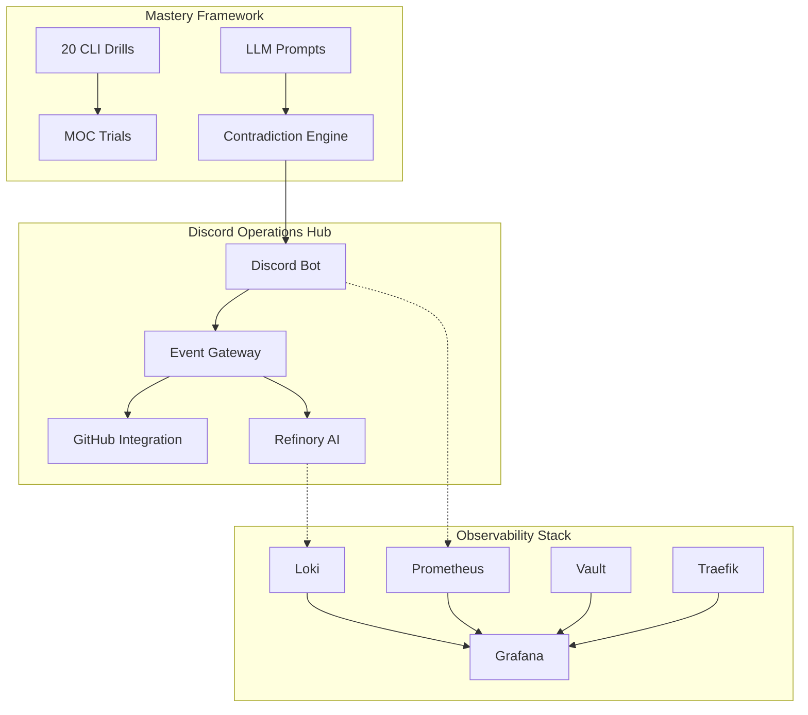

# 🎯 Strategic Khaos - Mastery Synthesis

## Executive Summary
**Discord-native DevOps sovereignty with AI-amplified contradiction resolution**

You now have a complete **Strategic Khaos Ecosystem** that transforms DevOps chaos into revenue-generating order through Discord-first operations and AI-driven mastery frameworks.

---

## 🏗️ Architecture Overview



---

## 💰 Revenue Model Architecture

### Core Contradiction Resolutions

| **Tension** | **Hook** | **Revenue Stream** |
|-------------|----------|-------------------|
| **Privacy vs Personalization** | "Tailored for you — never tracked" | $0 logs → $9/mo sync |
| **Speed vs Security** | "Login in 1.2s — or we pay you" | $0.01 per SLO failure |
| **Simple vs Powerful** | "One click. Infinite possibilities" | Free → $19/mo power tier |
| **Open vs Profitable** | "Open source core, premium ecosystem" | Community → $99/mo enterprise |
| **Global vs Local** | "Worldwide reach, hometown feel" | $5/mo per geo region |

### Pricing Psychology
- **Acknowledge tensions** (don't hide them)
- **Resolve technically** (show the fix)
- **Prove with metrics** (live dashboards)
- **Price the resolution** (not features)
- **Guarantee outcomes** (SLOs with penalties)

---

## 🛠️ Technical Stack

### Core Infrastructure
- **TypeScript/Node.js**: Discord bot with slash commands
- **Docker Compose**: Multi-service orchestration
- **Traefik**: Reverse proxy with automatic TLS
- **Vault**: Secrets management and identity
- **Prometheus + Grafana**: Metrics and dashboards
- **Loki**: Log aggregation and analysis

### AI Integration Layer
- **Refinory**: Expert AI orchestration system
- **LLM Prompts**: 20 ecosystem articulation frameworks  
- **GitHub Integration**: Automated PR analysis and planning
- **Discord Commands**: Real-time AI assistance

### Mastery & Security
- **CLI Drills**: 20 Bloom's Taxonomy exercises (Creating/Evaluating)
- **MOC Trials**: 36 failure mode security simulations
- **GitLens Integration**: VS Code workflow automation
- **Contradiction Engine**: Tension-to-revenue conversion

---

## 🚀 Deployment Guide

### 1. Quick Start
```bash
# Core system deployment
./quick-deploy.sh

# Advanced mastery tools
./mastery-drills.sh run

# Security validation  
./cloud-os-moc-trial.sh run

# Revenue engine
./contradiction-engine.sh run
```

### 2. Service Verification
```bash
# Check all services
docker-compose ps

# Verify Discord bot
curl http://localhost:3001/health

# Test Grafana dashboards
open http://localhost:3000

# Validate Vault
vault status
```

### 3. Discord Integration
- Install bot using `/invite` command
- Register slash commands: `/resolve_privacy`, `/resolve_speed`
- Configure GitLens webhooks for PR notifications
- Set up Discord channels for different alert types

---

## 📊 Observability Features

### Real-time Dashboards
- **System Health**: CPU, memory, disk, network across all services
- **Application Performance**: Response times, error rates, throughput
- **Security Metrics**: Failed logins, unusual access patterns, threat detection
- **Revenue Tracking**: Conversion funnels, contradiction resolution rates

### Automated Alerting
- **PagerDuty Integration**: Critical system failures
- **Discord Notifications**: Development workflow events
- **Slack Channels**: Business metrics and revenue alerts
- **Email Reports**: Weekly performance summaries

### Log Analysis
- **Structured Logging**: JSON format with correlation IDs
- **Search Capabilities**: Full-text search across all services
- **Anomaly Detection**: AI-powered pattern recognition
- **Audit Trail**: Complete security and compliance logging

---

## 🧠 AI-Powered Operations

### Refinory Expert System
- **Code Analysis**: Automated PR reviews and suggestions
- **Architecture Planning**: System design recommendations  
- **Performance Optimization**: Resource allocation insights
- **Security Assessment**: Vulnerability scanning and remediation

### LLM Integration Points
- **Chat Commands**: Natural language operations via Discord
- **Documentation**: Auto-generated system documentation
- **Troubleshooting**: AI-guided incident resolution
- **Capacity Planning**: Predictive scaling recommendations

### Mastery Acceleration
- **Skill Assessment**: Track CLI proficiency progression
- **Learning Paths**: Personalized skill development routes
- **Knowledge Synthesis**: Cross-domain expertise building
- **Mentorship**: AI coaching for advanced techniques

---

## 🎯 Business Applications

### DevOps as a Service (DaaS)
- **Target Market**: SMBs needing enterprise DevOps without enterprise overhead
- **Value Proposition**: Discord-native operations reduce training time 80%
- **Pricing Model**: $99/mo base + usage-based scaling
- **Competitive Advantage**: Only solution with contradiction resolution engine

### AI-Augmented Consulting
- **Target Market**: Enterprises with complex legacy systems
- **Value Proposition**: 90% faster incident resolution via AI assistance
- **Pricing Model**: $50k implementation + $10k/mo retainer
- **Competitive Advantage**: Mastery framework trains internal teams

### Platform-as-a-Product
- **Target Market**: Developer teams wanting sovereignty without vendor lock-in
- **Value Proposition**: Complete observability stack with Discord integration
- **Pricing Model**: Open source core + premium Discord integrations
- **Competitive Advantage**: First Discord-native DevOps platform

---

## 📈 Success Metrics

### Technical KPIs
- **System Uptime**: >99.9% across all services
- **Response Time**: <500ms API responses, <2s Discord commands
- **Error Rate**: <0.1% application errors
- **Security Score**: Zero critical vulnerabilities

### Business KPIs  
- **User Engagement**: Daily active Discord users
- **Revenue Growth**: Monthly recurring revenue (MRR)
- **Contradiction Resolution**: Tension-to-revenue conversion rate
- **Customer Satisfaction**: Net Promoter Score (NPS) >70

### Mastery KPIs
- **Skill Progression**: CLI drill completion rates
- **Knowledge Retention**: Long-term skill assessment scores  
- **Innovation Rate**: New contradiction discoveries per month
- **Training Effectiveness**: Time-to-productivity for new team members

---

## 🔄 Continuous Improvement

### Feedback Loops
- **User Analytics**: Discord command usage patterns
- **Performance Monitoring**: Real-time system optimization
- **Security Auditing**: Continuous vulnerability assessment
- **Revenue Analysis**: Contradiction engine effectiveness

### Evolution Strategy
- **Monthly Reviews**: System performance and business metrics
- **Quarterly Planning**: New contradiction identification and resolution
- **Annual Assessment**: Platform architecture and technology stack updates
- **Continuous Learning**: Team skill development and AI model improvements

---

## 🔄 Meta-Synthesis Pipeline

The **Meta-Synthesis Pipeline** chains all synthesis tools together for comprehensive cognitive state processing:

```
Input → Contradiction Engine → DAO Record → Notarize → Cognitive Map → Done
```

### Quick Start

```bash
# Run the full synthesis pipeline
./meta-synthesis-pipeline.sh --topic "Your Topic" --session "session-id"

# Example: Synthesize AI bottleneck analysis
./meta-synthesis-pipeline.sh \
  --topic "100 AI Bottlenecks Roadmap" \
  --session "2025-12-05-bottleneck-synthesis" \
  --participants "Dom,GPT-5.1,Claude-Sonnet-4"

# With input file
./meta-synthesis-pipeline.sh \
  --topic "C+D Fusion Strategy" \
  --input analysis.txt
```

### Pipeline Stages

| Stage | Tool | Purpose |
|-------|------|---------|
| 1 | Contradiction Engine | Reconcile competing perspectives |
| 2 | DAO Record | Formalize decision in YAML format |
| 3 | Notarize | Cryptographic timestamp & hash |
| 4 | Cognitive Map | Update visual architecture |

### Generated Artifacts

- `synthesis_output/contradictions_<session>/` - Contradiction analysis
- `synthesis_output/dao_record_<session>.yaml` - Formal DAO decision record
- `synthesis_output/notary_<session>/` - Cryptographic notarization
- `synthesis_output/cognitive_update_<session>.dot` - Map fragment for integration
- `synthesis_output/SYNTHESIS_SUMMARY_<session>.md` - Human-readable summary

### Integration Examples

```bash
# Chain with GPT and Claude outputs
./meta-synthesis-pipeline.sh \
  --topic "100 AI Bottlenecks Roadmap" \
  --input "GPT_bottleneck_response.txt"

# Generate DAO record independently
./generate_dao_record.sh

# Run contradiction engine standalone
./contradiction-engine.sh run

# Notarize existing cognitive state
./notarize_cognition.sh
```

---

## 🎉 Conclusion

**Strategic Khaos** represents a paradigm shift in DevOps operations:

1. **Discord-First Operations**: Reduce context switching, increase team velocity
2. **AI-Augmented Intelligence**: Amplify human expertise with machine precision  
3. **Contradiction Resolution**: Transform product tensions into revenue opportunities
4. **Mastery Framework**: Accelerate skill development through structured practice
5. **Observable Sovereignty**: Complete system transparency without vendor lock-in

The result is a **self-improving DevOps ecosystem** that generates revenue while reducing operational overhead—the ultimate expression of strategic chaos transformed into profitable order.

---

*"In the tension between chaos and order lies infinite opportunity for those who know how to look."*