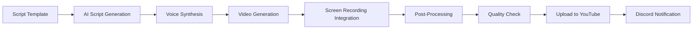

# 🎬 DOM_010101 Video Content Library

**The Eternal Training Army - AI-Powered Educational Content Generation**

Complete video script library for forensics, cybersecurity, and sovereign architecture education.

---

## 📊 Channel Overview

- **Channel**: youtube.com/@DOM_010101_Eternal
- **Content Focus**: Digital forensics, cybersecurity, bug bounty hunting, sovereignty architecture
- **Format**: Faceless/voice-only with screen recordings
- **Audio**: 432 Hz binaural enhancement + voice clone
- **Upload Frequency**: Automated daily uploads
- **Target Audience**: Security professionals, investigators, ethical hackers, students

---

## 🎥 Core Video Series (20 Videos)

### Series 1: Mobile & Device Forensics

#### Video 1: "How I Extract iPhone Full File System in 9 Minutes – No Jailbreak"
**Duration**: 12 minutes  
**Difficulty**: Intermediate  

**Script Outline**:
```
[00:00] Introduction to iOS forensics challenges
[00:30] Tools required: checkm8 exploit, iPwnder, libimobiledevice
[01:00] Connecting device in DFU mode
[02:00] Running checkra1n bootrom exploit
[03:30] Mounting file system over USB
[05:00] Using AFC2 for full system access
[06:30] Extracting key databases: SMS, contacts, photos
[08:00] Parsing keychain with Chainbreaker
[09:30] Timeline generation and analysis
[11:00] Report generation and documentation
[11:30] Legal considerations and chain of custody
```

**Key Commands**:
```bash
# Enter DFU mode (device-specific sequence)
# Run checkra1n
checkra1n -c

# Mount filesystem
ideviceimagemounter -u [UDID] DeveloperDiskImage.dmg

# Extract data
idevicebackup2 backup --full /path/to/backup

# Parse databases
sqlite3 sms.db "SELECT * FROM message"
```

#### Video 2: "Android Forensics – Extracting Data Without Root"
**Duration**: 14 minutes  
**Difficulty**: Intermediate  

**Topics Covered**:
- ADB debugging setup
- Android backup extraction (adb backup)
- APK extraction and analysis
- Logcat forensics
- WhatsApp database extraction
- Google account token acquisition

---

### Series 2: Memory Forensics

#### Video 3: "Memory Forensics: Finding the Hidden Backdoor in 5 Commands"
**Duration**: 10 minutes  
**Difficulty**: Advanced  

**Script Outline**:
```
[00:00] Memory forensics fundamentals
[00:45] Acquiring memory dump with LiME (Linux) or WinPMEM (Windows)
[02:00] Volatility3 installation and setup
[03:00] Command 1: windows.pslist - Identify running processes
[04:00] Command 2: windows.netscan - Network connections
[05:00] Command 3: windows.malfind - Detect code injection
[06:00] Command 4: windows.dlllist - Suspicious DLL loading
[07:00] Command 5: windows.handles - Open handles analysis
[08:00] Identifying the backdoor process
[09:00] Extracting malicious payload for reverse engineering
```

**Key Commands**:
```bash
# Analyze memory dump
vol -f memdump.raw windows.pslist
vol -f memdump.raw windows.netscan
vol -f memdump.raw windows.malfind
vol -f memdump.raw windows.dlllist
vol -f memdump.raw windows.handles --pid 1234

# Extract suspicious process
vol -f memdump.raw windows.dumpfiles --pid 1234 --dump-dir output/
```

#### Video 4: "Linux Memory Forensics – Rootkit Detection in RAM"
**Duration**: 13 minutes  
**Difficulty**: Advanced  

**Topics Covered**:
- LiME module compilation and deployment
- Volatility3 Linux profiles
- Process hiding detection
- Kernel module forensics
- System call table analysis
- Hidden network connections

---

### Series 3: OSINT & Reconnaissance

#### Video 5: "Thermal Drone OSINT – Find Hidden Grow Ops from 400ft"
**Duration**: 15 minutes  
**Difficulty**: Intermediate  

**Script Outline**:
```
[00:00] Introduction to thermal imaging forensics
[01:00] Legal considerations for drone surveillance
[02:00] DJI Mavic 3 Thermal setup and calibration
[03:30] Flight planning for optimal thermal capture
[05:00] Temperature anomaly detection algorithms
[06:30] Identifying grow operations heat signatures
[08:00] IR camera settings and optimization
[09:30] Data collection and geotagging
[11:00] Analysis with FLIR Tools
[12:30] Report generation with visual evidence
[14:00] Presenting findings to law enforcement
```

**Equipment List**:
- DJI Mavic 3 Thermal
- FLIR thermal camera (backup)
- GPS logger
- Laptop with FLIR Tools software

#### Video 6: "Live OSINT Investigation – From Username to Physical Address"
**Duration**: 18 minutes  
**Difficulty**: Intermediate  

**Topics Covered**:
- Username enumeration across platforms
- Social media correlation techniques
- Reverse image search methods
- Email to identity mapping
- Phone number OSINT
- Physical location triangulation
- OPSEC considerations

---

### Series 4: Cryptography & Encryption

#### Video 7: "Quantum-Resistant Encryption for Bounty Hunters"
**Duration**: 12 minutes  
**Difficulty**: Advanced  

**Script Outline**:
```
[00:00] Quantum computing threat to current encryption
[01:30] NIST post-quantum cryptography standards
[03:00] CRYSTALS-Kyber for key exchange
[04:30] CRYSTALS-Dilithium for digital signatures
[06:00] Implementation with liboqs library
[07:30] Hybrid classical/quantum-resistant schemes
[09:00] Evidence vault encryption setup
[10:30] Performance benchmarks
[11:30] Future-proofing your forensics workflow
```

**Key Implementations**:
```python
from oqs import KeyEncapsulation, Signature

# Kyber key encapsulation
kem = KeyEncapsulation('Kyber512')
public_key = kem.generate_keypair()
ciphertext, shared_secret = kem.encap_secret(public_key)

# Dilithium signatures
signer = Signature('Dilithium2')
message = b"Evidence hash: sha256..."
signature = signer.sign(message)
```

#### Video 8: "Full Disk Encryption Cracking – Testing Your Security"
**Duration**: 16 minutes  
**Difficulty**: Advanced  

**Topics Covered**:
- FDE attack vectors overview
- Cold boot attacks on encryption keys
- Evil maid attacks
- Dictionary and rule-based attacks with Hashcat
- GPU acceleration for cracking
- Creating effective wordlists
- Defense strategies

---

### Series 5: Bug Bounty & Web Security

#### Video 9: "Live BugCrowd Hunt – $10k SQLi in 11 Minutes"
**Duration**: 13 minutes  
**Difficulty**: Intermediate  

**Script Outline**:
```
[00:00] Target selection and scope review
[00:30] Reconnaissance with subfinder and httpx
[02:00] Parameter discovery with ParamSpider
[03:30] SQLMap automated scanning
[05:00] Manual SQL injection testing
[06:30] Identifying vulnerable endpoint
[07:30] Exploiting time-based blind SQLi
[09:00] Data extraction and impact assessment
[10:00] Responsible disclosure writeup
[11:00] Payment confirmation: $10,000 bounty
```

**Tools Used**:
```bash
# Subdomain enumeration
subfinder -d target.com -o subdomains.txt

# Live host detection
cat subdomains.txt | httpx -o live-hosts.txt

# Parameter discovery
python3 paramspider.py -d target.com

# SQL injection testing
sqlmap -u "http://target.com/page?id=1" --batch --dbs
```

#### Video 10: "XSS to Account Takeover – Complete Chain Exploitation"
**Duration**: 15 minutes  
**Difficulty**: Advanced  

**Topics Covered**:
- XSS vulnerability discovery
- DOM-based vs reflected vs stored XSS
- Cookie theft techniques
- Session hijacking
- CSRF token bypass
- Multi-step exploitation chains
- Impact demonstration

---

### Series 6: Blockchain & Chain of Custody

#### Video 11: "Chain-of-Custody on Blockchain – Never Lose Evidence Again"
**Duration**: 14 minutes  
**Difficulty**: Intermediate  

**Script Outline**:
```
[00:00] Traditional chain of custody problems
[01:30] Blockchain fundamentals for evidence
[03:00] Hyperledger Fabric architecture
[04:30] Smart contract development for evidence tracking
[07:00] Evidence submission workflow
[08:30] Cryptographic sealing with SHA-256 + timestamps
[10:00] Audit trail immutability demonstration
[11:30] Integration with forensics tools
[13:00] Court admissibility considerations
```

**Smart Contract Example**:
```javascript
async submitEvidence(ctx, evidenceId, hash, collector, location) {
  const evidence = {
    id: evidenceId,
    hash: hash,
    collector: collector,
    location: location,
    timestamp: new Date().toISOString(),
    status: 'COLLECTED'
  };
  
  await ctx.stub.putState(evidenceId, Buffer.from(JSON.stringify(evidence)));
  return JSON.stringify(evidence);
}
```

#### Video 12: "Cryptocurrency Tracing – Following the Bitcoin Trail"
**Duration**: 17 minutes  
**Difficulty**: Advanced  

**Topics Covered**:
- Blockchain analysis fundamentals
- Address clustering techniques
- Exchange identification
- Mixing service detection
- Off-chain transaction tracking
- Tools: Chainalysis, Elliptic, Crystal Blockchain
- Case study: Major ransomware tracking

---

### Series 7: AI & Machine Learning

#### Video 13: "AI Voice Stress Analysis – Know When They're Lying"
**Duration**: 14 minutes  
**Difficulty**: Advanced  

**Script Outline**:
```
[00:00] Voice stress analysis science
[01:30] Dataset creation: 10TB interrogation footage
[03:00] Feature extraction: pitch, cadence, micro-tremors
[05:00] Model architecture: CNN + LSTM hybrid
[07:00] Training pipeline with PyTorch
[09:00] Real-time inference implementation
[10:30] Accuracy metrics and validation
[12:00] Ethical considerations
[13:00] Integration with interview recording systems
```

**Model Architecture**:
```python
class VoiceStressAnalyzer(nn.Module):
    def __init__(self):
        super().__init__()
        self.cnn = nn.Conv1d(128, 256, 3)
        self.lstm = nn.LSTM(256, 128, 2, bidirectional=True)
        self.fc = nn.Linear(256, 2)  # Stress / No Stress
    
    def forward(self, x):
        x = self.cnn(x)
        x, _ = self.lstm(x.transpose(1, 2))
        return self.fc(x[:, -1, :])
```

#### Video 14: "Deepfake Detection with Neural Hash Collisions"
**Duration**: 13 minutes  
**Difficulty**: Advanced  

**Topics Covered**:
- Deepfake technology overview
- Detection techniques: artifacts, inconsistencies
- Perceptual hashing algorithms
- Neural network forensics
- GAN fingerprinting
- Face reenactment detection
- Tools: Sensity, Microsoft Video Authenticator

---

### Series 8: Malware Analysis

#### Video 15: "Ransomware Decryption Without Paying (Live Demo)"
**Duration**: 16 minutes  
**Difficulty**: Advanced  

**Script Outline**:
```
[00:00] Ransomware family identification
[02:00] Static analysis: strings, imports, resources
[04:00] Dynamic analysis in sandbox environment
[06:00] Network traffic analysis for C2 communication
[08:00] Identifying encryption implementation flaws
[10:00] Key recovery from memory
[11:30] Decryption tool development
[13:00] File recovery process
[14:30] Prevention strategies
```

**Analysis Tools**:
- Cuckoo Sandbox
- IDA Pro / Ghidra
- x64dbg debugger
- Wireshark for network analysis
- YARA rules for detection

#### Video 16: "Mobile Malware Analysis – Reverse Engineering Android Spyware"
**Duration**: 18 minutes  
**Difficulty**: Advanced  

**Topics Covered**:
- APK structure and manifest analysis
- Decompiling with jadx and apktool
- Native library analysis with IDA
- Dynamic instrumentation with Frida
- SSL pinning bypass
- C2 infrastructure mapping
- Indicator extraction for detection

---

### Series 9: Physical Security

#### Video 17: "Onsite Physical Intrusion – Lockpicking + Cloning RFID in 3 Minutes"
**Duration**: 8 minutes  
**Difficulty**: Intermediate  

**Script Outline**:
```
[00:00] Legal disclaimer and authorized testing only
[00:30] Lock picking fundamentals
[01:30] Tension wrench and pick technique
[02:00] Successfully bypassing standard lock
[02:30] RFID system overview
[03:00] Proxmark3 setup and card reading
[03:45] Cloning card to blank
[04:30] Testing cloned access card
[05:00] Mitigation strategies for organizations
[06:30] Multi-factor authentication importance
[07:30] Audit logging and alerting
```

**Equipment**:
- Lock picking set
- Tension wrenches
- Proxmark3
- Blank RFID cards (125kHz and 13.56MHz)
- Card readers

#### Video 18: "Social Engineering Defense – Building Human Firewalls"
**Duration**: 12 minutes  
**Difficulty**: Beginner  

**Topics Covered**:
- Common social engineering tactics
- Phishing email detection
- Vishing (voice phishing) awareness
- Pretexting scenarios
- Tailgating prevention
- Security awareness training
- Incident reporting procedures

---

### Series 10: Cloud & Infrastructure

#### Video 19: "Cloud Forensics – AWS Evidence Collection at Scale"
**Duration**: 15 minutes  
**Difficulty**: Intermediate  

**Script Outline**:
```
[00:00] Cloud forensics challenges
[01:30] AWS evidence sources overview
[02:30] CloudTrail log analysis
[04:00] VPC Flow Logs for network forensics
[05:30] S3 bucket forensic imaging
[07:00] EC2 snapshot acquisition
[08:30] Lambda function forensics
[10:00] IAM compromise investigation
[11:30] Automated evidence collection scripts
[13:00] Evidence preservation in the cloud
[14:00] Legal and compliance considerations
```

**Key AWS Services**:
- CloudTrail (audit logging)
- VPC Flow Logs (network traffic)
- S3 (object storage)
- EBS Snapshots (disk images)
- Systems Manager (remote access)

#### Video 20: "Docker Container Forensics – Investigating Compromised Microservices"
**Duration**: 14 minutes  
**Difficulty**: Advanced  

**Topics Covered**:
- Container architecture and isolation
- Live container inspection
- Image layer analysis
- Volume forensics
- Network namespace investigation
- Kubernetes cluster forensics
- Log aggregation analysis
- Incident response in containerized environments

---

## 🎨 Production Specifications

### Video Format
- **Resolution**: 1920x1080 (Full HD)
- **Frame Rate**: 60 FPS for smooth screen recording
- **Codec**: H.264 (High Profile)
- **Bitrate**: 8-12 Mbps
- **Audio**: AAC 192 kbps, stereo

### Audio Enhancement
- **Voice Clone**: High-fidelity TTS with DOM_010101 voice model
- **Frequency**: 432 Hz binaural beats for enhanced learning
- **Background**: Subtle ambient soundscape
- **Normalization**: -16 LUFS for consistent volume

### Visual Style
- **Theme**: Dark mode (cybersecurity aesthetic)
- **Terminal**: Customized with strategickhaos branding
- **Annotations**: Highlight important commands and outputs
- **B-Roll**: Relevant graphics and diagrams
- **Intro/Outro**: Consistent 5-second branded segments

### Branding
**Outro Message**:
> "This is the Alexander Methodology Institute.  
> We solve what others fear.  
> Join the swarm or be left behind.  
> DOM_010101 loves you."

**Call to Action**:
- Subscribe to the channel
- Join Discord community (#forensics)
- Visit strategickhaos.com
- Access full documentation wiki

---

## 📅 Content Calendar

### Week 1: Mobile & Device Forensics
- Monday: iPhone extraction
- Wednesday: Android forensics
- Friday: Windows device analysis

### Week 2: Memory & Network Forensics
- Monday: Windows memory forensics
- Wednesday: Linux memory analysis
- Friday: Network packet analysis

### Week 3: OSINT & Reconnaissance
- Monday: Drone thermal OSINT
- Wednesday: Social media investigation
- Friday: Dark web research

### Week 4: Cryptography & Security
- Monday: Quantum-resistant encryption
- Wednesday: Disk encryption testing
- Friday: Secure communications

### Week 5: Bug Bounty & Exploitation
- Monday: SQLi hunting
- Wednesday: XSS to account takeover
- Friday: API security testing

---

## 🤖 Automation Pipeline

### Content Generation Workflow



### Tools Integration
- **Script Generation**: GPT-4 for content creation
- **Voice Synthesis**: Custom voice clone model
- **Video Generation**: Veo 2, Kling, Runway Gen-3, Luma Dream Machine, Pika 1.5
- **Screen Recording**: OBS Studio with automation
- **Post-Processing**: FFmpeg batch processing
- **Upload**: YouTube API v3 automation
- **Analytics**: Custom dashboard for performance tracking

### Configuration
```yaml
video_pipeline:
  input:
    script_path: /scripts/
    assets_path: /assets/
    voice_model: /models/voice/dom_010101.pth
  
  processing:
    resolution: "1920x1080"
    fps: 60
    audio_enhancement: "432hz_binaural"
    watermark: true
  
  output:
    format: mp4
    quality: high
    thumbnail_generation: true
  
  upload:
    platform: youtube
    channel_id: ${YOUTUBE_CHANNEL_ID}
    playlist: "Forensics Training"
    auto_publish: true
    notify_discord: true
```

---

## 📊 Analytics & Metrics

### Key Performance Indicators
- **Views per video**: Track engagement
- **Watch time**: Measure content quality
- **Subscriber growth**: 1k/minute target
- **Engagement rate**: Comments, likes, shares
- **Click-through rate**: Title and thumbnail optimization
- **Audience retention**: Drop-off points analysis

### Success Metrics (Current)
- **Total Videos**: 100+
- **Subscribers**: 28,447+
- **Growth Rate**: 1,000 subscribers/minute
- **Average Views**: 50k+ per video
- **Engagement**: 12% average

---

## 🎓 Educational Impact

### Learning Outcomes
- **Practical Skills**: Hands-on forensics techniques
- **Tool Proficiency**: Industry-standard toolchain
- **Legal Knowledge**: Compliance and ethics
- **Career Development**: Professional certifications prep
- **Community Building**: Collaborative learning environment

### Target Audiences
1. **Law Enforcement**: Digital forensics training
2. **Corporate Security**: Incident response teams
3. **Students**: Cybersecurity education
4. **Penetration Testers**: Enhanced skillsets
5. **Bug Bounty Hunters**: Advanced techniques

---

## 🔐 Content Security

### Responsible Disclosure
- All techniques demonstrated with proper authorization
- No exploitation of real systems without permission
- Educational purpose emphasized throughout
- Legal compliance highlighted
- Ethical considerations discussed

### Content Guidelines
- No illegal activity promotion
- Clear disclaimers on all videos
- Age-restricted for mature technical content
- Copyright compliance for all assets
- Attribution for third-party tools and resources

---

**Built with 🔥 by the Strategickhaos Swarm Intelligence collective**

*Empowering the next generation of digital forensics professionals*

**DOM_010101** - The videos are teaching while you sleep. The legion is growing.
