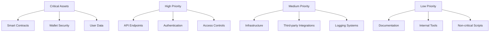
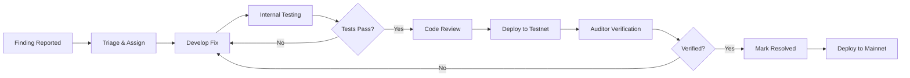

# Security Audit Framework
**Trail of Bits Engagement and Transparency Guidelines**

> **INTERNAL DRAFT — NOT LEGAL ADVICE — ATTORNEY REVIEW REQUIRED**
> 
> This framework establishes procedures for engaging professional security auditors and maintaining transparency throughout the audit process.

## Overview

Regular professional security audits are critical for identifying vulnerabilities before malicious actors can exploit them. This framework prioritizes comprehensive audits by leading firms like Trail of Bits, with full public transparency of findings.

**Philosophy**: "Security through transparency, not obscurity"

---

## Audit Strategy

### Audit Frequency

```yaml
audit_schedule:
  comprehensive_audit:
    frequency: Annual
    scope: Full platform (smart contracts, infrastructure, code)
    provider: Trail of Bits or equivalent top-tier firm
    
  smart_contract_audit:
    frequency: Before each major contract deployment
    scope: Specific contract and dependencies
    provider: Trail of Bits, OpenZeppelin, ConsenSys Diligence
    
  infrastructure_audit:
    frequency: Bi-annual
    scope: Servers, networks, access controls
    provider: Specialized infrastructure security firm
    
  code_review:
    frequency: Continuous
    scope: GitHub pull requests
    provider: Internal team + CodeQL automation
```

### Audit Scope Prioritization



---

## Trail of Bits Engagement

### Why Trail of Bits?

- **Reputation**: Industry-leading security research firm
- **Expertise**: Deep knowledge of blockchain, smart contracts, and cryptography
- **Thoroughness**: Comprehensive methodology and detailed reporting
- **Credibility**: Reports carry significant weight with community and investors

### Engagement Process

#### Phase 1: Initial Contact (Week 1)

```yaml
initial_contact:
  method: Email to contact@trailofbits.com
  cc: sales@trailofbits.com
  subject: "Security Audit Request - Strategickhaos DAO LLC"
  
  include:
    - Organization overview
    - Audit scope (contracts, repositories, infrastructure)
    - Preferred timeline
    - Budget range
    - Previous audit reports (if any)
```

**Email Template**:
```
Subject: Security Audit Request - Strategickhaos DAO LLC

Dear Trail of Bits Team,

We are Strategickhaos DAO LLC, a 501(c)(3) nonprofit organization building 
decentralized DevOps infrastructure. We are seeking a comprehensive security 
audit of our smart contracts and platform.

Scope:
- $CHAOS token contract (ERC-20)
- NFT collection contract (ERC-721)
- Governance contracts
- Discord bot and event gateway infrastructure

Timeline: Preferred start within 4-6 weeks
Budget: $50,000 - $100,000 (flexible based on scope)

We are committed to publishing the full audit report publicly, unredacted.

Please let us know your availability and we can schedule a scoping call.

Best regards,
Domenic Garza
Founder, Strategickhaos DAO LLC
```

#### Phase 2: Scoping Call (Week 1-2)

**Agenda**:
- [ ] Introduce organization and mission
- [ ] Explain technical architecture
- [ ] Define audit scope and priorities
- [ ] Discuss timeline and deliverables
- [ ] Review pricing and payment terms
- [ ] Clarify transparency requirements

**Pre-Call Preparation**:
- Technical documentation package
- Architecture diagrams
- Threat model (100 Ways We Die)
- Previous security assessments
- Smart contract code (GitHub links)

#### Phase 3: Contract & Payment (Week 2-3)

```yaml
contract_terms:
  deliverables:
    - Comprehensive audit report (PDF)
    - Executive summary
    - Detailed findings with severity ratings
    - Remediation recommendations
    - Re-audit of critical findings (included or separate)
    
  payment_structure:
    option_1: 50% upfront, 50% upon delivery
    option_2: 100% upfront (may get discount)
    option_3: Milestone-based payments
    
  timeline:
    typical_duration: 2-4 weeks for smart contract audit
    extended_duration: 6-8 weeks for full platform audit
    
  confidentiality:
    nda: Standard mutual NDA
    public_disclosure: Full report published after remediation
    embargo_period: 30-90 days for critical vulnerability fixes
```

**Budget Allocation**:
- Smart contract audit: $25,000 - $50,000
- Infrastructure audit: $30,000 - $60,000
- Re-audit: $10,000 - $20,000
- Total comprehensive audit: $65,000 - $130,000

---

## Pre-Audit Preparation

### Documentation Package

```yaml
required_documents:
  technical:
    - README with setup instructions
    - Architecture documentation
    - Smart contract specifications
    - API documentation
    - Infrastructure diagrams
    - Threat model
    
  business:
    - Organization overview
    - User personas and use cases
    - Token economics (if applicable)
    - Governance model
    
  security:
    - Known issues or concerns
    - Previous audit reports
    - Bug bounty program details
    - Incident response history
```

### Code Preparation

```bash
#!/bin/bash
# prepare-for-audit.sh - Prepare codebase for security audit

# 1. Create clean audit branch
git checkout -b audit/trail-of-bits-2025-q1
git push origin audit/trail-of-bits-2025-q1

# 2. Ensure all documentation is up-to-date
./scripts/generate-docs.sh

# 3. Run internal security checks
npm run lint
npm run test
npm run security-scan

# 4. Generate code metrics
cloc --by-file --json > code-metrics.json
npx madge --circular --json > circular-deps.json

# 5. Package for auditors
mkdir -p audit-package/
cp -r contracts audit-package/
cp -r docs audit-package/
cp -r test audit-package/
tar -czf strategickhaos-audit-$(date +%Y%m%d).tar.gz audit-package/
```

### Access Provisioning

```yaml
auditor_access:
  github:
    - Read access to all relevant repositories
    - Ability to file issues (labeled "audit-finding")
    - Optional: Write access to audit branch for comments
    
  infrastructure:
    - VPN access (if reviewing infrastructure)
    - Read-only access to monitoring dashboards
    - Documentation of network architecture
    
  communication:
    - Private Slack/Discord channel with team
    - Email distribution list
    - Emergency contact information
    
  restrictions:
    - No mainnet access or transaction signing
    - No production database access
    - Testnet/staging environment only
```

---

## During Audit

### Team Responsibilities

```yaml
audit_point_of_contact:
  primary: Technical Lead
  backup: Founder
  responsibilities:
    - Respond to auditor questions within 24 hours
    - Provide additional documentation as requested
    - Schedule clarification calls as needed
    - Track findings and remediation progress
    
audit_response_sla:
  critical_questions: 4 hours
  general_questions: 24 hours
  documentation_requests: 48 hours
  
communication_protocol:
  regular_checkins: Bi-weekly video calls
  ad_hoc_communication: Slack/Discord for quick questions
  formal_communication: Email for scope changes or findings
```

### Audit Progress Tracking

```yaml
# audit-tracker.yaml
audit_details:
  firm: Trail of Bits
  start_date: 2025-12-01
  end_date: 2025-12-22
  auditors: [Alice, Bob]
  
status:
  phase: In Progress
  progress: 60%
  findings_so_far: 12 (3 high, 5 medium, 4 low)
  
weekly_updates:
  week_1:
    - Scoping and setup complete
    - Review of architecture documentation
    - Initial automated scans completed
    
  week_2:
    - Manual code review of smart contracts
    - 8 findings identified
    - Clarification call on token economics
    
  week_3:
    - Infrastructure review commenced
    - Additional 4 findings identified
    - Team began remediation of high-severity items
```

---

## Audit Findings Management

### Severity Classification

| Severity | Description | Response Time | Example |
|----------|-------------|---------------|---------|
| **Critical** | Immediate exploit risk, funds at risk | <24 hours | Reentrancy bug allowing fund theft |
| **High** | Significant security impact | <72 hours | Access control bypass |
| **Medium** | Moderate risk or impact | <1 week | Information disclosure |
| **Low** | Minor issue or best practice | <2 weeks | Code quality improvement |
| **Informational** | Suggestion or observation | Non-urgent | Gas optimization |

### Remediation Workflow



### Tracking System

```yaml
# findings-tracker.yaml
findings:
  - id: TOB-001
    severity: High
    title: "Reentrancy vulnerability in withdraw function"
    status: Fixed & Verified
    assigned_to: Core Team Member 1
    resolution: "Implemented checks-effects-interactions pattern"
    commit: abc123
    auditor_verified: true
    
  - id: TOB-002
    severity: Medium
    title: "Missing event emission in critical function"
    status: Fixed
    assigned_to: Core Team Member 2
    resolution: "Added Transfer event"
    commit: def456
    auditor_verified: false
    
  - id: TOB-003
    severity: Low
    title: "Gas optimization opportunity"
    status: Accepted Risk
    assigned_to: null
    resolution: "Will address in v2, minimal impact"
    auditor_verified: n/a
```

---

## Post-Audit Process

### Re-Audit

```yaml
re_audit_scope:
  included:
    - All critical and high severity findings
    - Changed code areas
    - Newly introduced functionality
    
  excluded:
    - Low severity items marked "won't fix"
    - Unchanged code sections
    
  timeline: 1-2 weeks after remediation complete
  
  deliverable: Re-audit memo confirming fixes
```

### Report Publication

**Embargo Period** (30-90 days):
- Critical vulnerabilities fixed
- Contracts redeployed (if necessary)
- Security monitoring enhanced
- Team prepared for public questions

**Publication Checklist**:
- [ ] All critical and high findings remediated
- [ ] Re-audit completed and verified
- [ ] Legal review of report for any confidential business information
- [ ] Prepare summary blog post
- [ ] Schedule community AMA
- [ ] Update documentation with security improvements

**Publication Locations**:
- GitHub repository (`/audits/trail-of-bits/YYYY-MM-Report.pdf`)
- Organization website (security page)
- Blog post with summary and learnings
- Social media announcement
- Newsletter to community

### Transparency Commitment

```markdown
## Audit Transparency Pledge

Strategickhaos DAO LLC commits to:

1. **Full Disclosure**: Publish complete audit reports, unredacted
2. **Timely Publication**: Within 90 days of receiving final report
3. **Remediation Transparency**: Publicly track fix status for all findings
4. **Learning Culture**: Share lessons learned with broader community
5. **Continuous Improvement**: Implement recommendations and fund future audits

We believe security is strengthened, not weakened, by transparency.
```

---

## Continuous Auditing

### Bug Bounty Program

```yaml
bug_bounty:
  platform: Immunefi or HackerOne
  
  rewards:
    critical: $10,000 - $50,000
    high: $5,000 - $10,000
    medium: $1,000 - $5,000
    low: $100 - $1,000
    
  scope:
    in_scope:
      - Smart contracts on mainnet
      - Web application (strategickhaos.org)
      - API endpoints
      - Discord bot
      
    out_of_scope:
      - Social engineering attacks
      - Denial of service
      - Third-party services
      - Previously known issues
      
  rules:
    - Responsible disclosure (90 day private report)
    - Proof of concept required
    - No testing on mainnet with real funds
    - One bug = one bounty (no duplicates)
```

### Automated Security Scanning

```yaml
continuous_security:
  static_analysis:
    tools:
      - Slither (smart contracts)
      - MythX (smart contracts)
      - Semgrep (general code)
      - CodeQL (GitHub)
    
    frequency: Every commit to main branch
    
  dependency_scanning:
    tools:
      - Dependabot (GitHub)
      - Snyk
      - npm audit
    
    frequency: Daily
    auto_update: Security patches only
    
  secret_scanning:
    tools:
      - GitHub Secret Scanning
      - GitLeaks
      - TruffleHog
    
    frequency: Real-time (pre-commit hook + CI)
```

---

## Audit History

### Tracking Template

```markdown
# Audit History

## 2025 Q4 - Trail of Bits Comprehensive Audit
- **Date**: December 2025
- **Scope**: Smart contracts ($CHAOS token, NFT collection, governance)
- **Findings**: 15 total (3 high, 7 medium, 5 low)
- **Status**: All critical/high remediated and verified
- **Report**: [View Report](./trail-of-bits/2025-q4-report.pdf)
- **Cost**: $75,000

## 2026 Q2 - Infrastructure Audit (Planned)
- **Date**: June 2026
- **Scope**: Discord bot, API, infrastructure
- **Firm**: TBD
- **Budget**: $40,000

## Continuous - Bug Bounty Program
- **Launch**: January 2026
- **Platform**: Immunefi
- **Bounties Paid**: $0 (as of launch)
- **Submissions**: 0 valid, 0 invalid
```

---

## Budget & Funding

### Annual Security Budget

```yaml
annual_security_budget: $200,000

allocation:
  trail_of_bits_audit: $75,000 (37.5%)
  infrastructure_audit: $40,000 (20%)
  bug_bounty_program: $50,000 (25%)
  security_tools: $15,000 (7.5%)
  training_certification: $10,000 (5%)
  contingency: $10,000 (5%)
  
funding_sources:
  - DAO treasury (primary)
  - Grant funds (if available)
  - Sovereign Defense Fund (if needed)
```

### ROI Justification

**Cost of Prevention**: $200,000/year  
**Cost of Breach**: Potentially millions + reputational damage  
**ROI**: 5-50x return on investment through breach prevention

---

## Success Metrics

### Audit Quality Metrics

- [ ] 100% of critical/high findings remediated
- [ ] Re-audit completed with no new critical issues
- [ ] Report published within 90 days
- [ ] Community feedback positive (>80% approval)
- [ ] Zero security incidents in audited areas (12 months)

### Program Metrics

- [ ] Annual comprehensive audit completed on schedule
- [ ] Bug bounty program active with >100 submissions/year
- [ ] Security tools fully integrated in CI/CD
- [ ] 100% of team members security trained
- [ ] Security spending <10% of annual budget

---

## Resources

### Audit Firms

**Tier 1** (Comprehensive):
- Trail of Bits: https://www.trailofbits.com
- OpenZeppelin: https://openzeppelin.com/security-audits
- ConsenSys Diligence: https://consensys.net/diligence

**Tier 2** (Specialized):
- Certik: https://www.certik.com
- Quantstamp: https://quantstamp.com
- Hacken: https://hacken.io

### Tools & Resources

- Slither: https://github.com/crytic/slither
- MythX: https://mythx.io
- Immunefi: https://immunefi.com
- HackerOne: https://www.hackerone.com

---

## Document Control

| Field | Value |
|-------|-------|
| Version | 1.0 |
| Status | Implementation Ready |
| Owner | Strategickhaos DAO LLC |
| Created | 2025-11-23 |
| Next Review | Quarterly |

---

*© 2025 Strategickhaos DAO LLC. Internal use only.*
