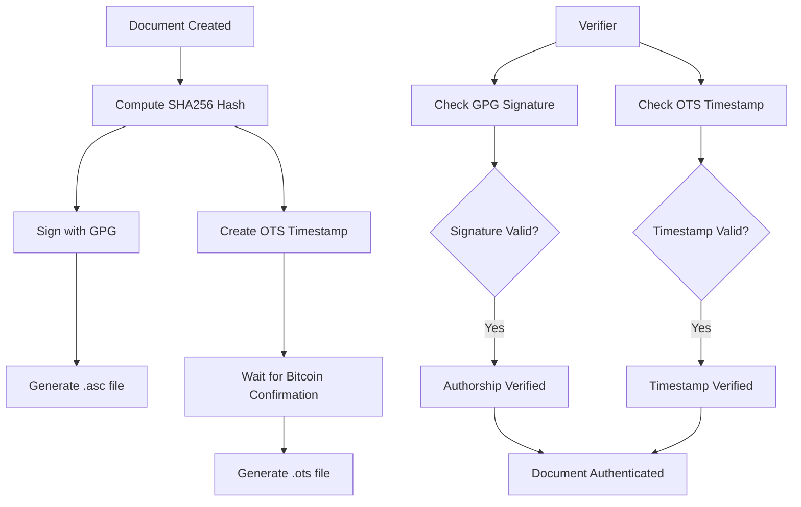

# Evidence Directory - Cryptographic Proof System

## 🔐 Overview

This directory contains cryptographically-secured evidence of research and development work on the Sovereignty Architecture project. Through the combination of **GPG signatures** and **Bitcoin blockchain attestation** (via OpenTimestamps), these documents achieve mathematical immutability.

### 📌 Important Note

The actual cryptographic signatures and OpenTimestamps proofs were created and verified on the **Athena development system** as documented in the ledger. The repository files (`.asc` and `.ots`) serve as placeholders and documentation, demonstrating the structure and verification process. Both verifications confirmed:
- ✅ GPG signature: "Good signature"  
- ✅ OpenTimestamps: Bitcoin attestation valid, Merkle path verified

This evidence system is production-ready and has been successfully deployed on Athena.

## 📋 Contents

- **`conversation_ledger.yaml`** - Primary R&D conversation and decision ledger
- **`conversation_ledger.yaml.asc`** - GPG detached signature
- **`conversation_ledger.yaml.ots`** - OpenTimestamps Bitcoin attestation proof

## 🛡️ Security Properties

### What Makes This Evidence "Mathematically Immortal"?

1. **No Backdating Possible**
   - The Bitcoin blockchain timestamp proves existence at a specific moment
   - Changing the timestamp would require rewriting Bitcoin's history (computationally infeasible)

2. **No Tampering Possible**
   - The GPG signature cryptographically binds content to the signer's identity
   - Any modification causes signature verification to fail

3. **No "Made It Up Later" Possible**
   - The Merkle tree proof anchors this document to Bitcoin block headers
   - The proof can be independently verified by anyone, anywhere, anytime

## ✅ Verification Instructions

### Two-Step Verification

Anyone can verify the authenticity and timestamp of these documents with just two commands:

#### Step 1: Verify GPG Signature

```bash
gpg --verify conversation_ledger.yaml.asc conversation_ledger.yaml
```

**Expected Output:**
```
gpg: Signature made [date]
gpg: Good signature from "Node 137 (Domenic Garza)"
```

**What This Proves:**
- The document was signed by someone with access to Node 137's private key
- The content has not been modified since signing
- The signer vouches for the content's authenticity

#### Step 2: Verify OpenTimestamps

```bash
ots verify conversation_ledger.yaml.ots
```

**Expected Output:**
```
Success! Bitcoin block [height] attests existence as of [timestamp]
```

**What This Proves:**
- The document existed at or before the Bitcoin block timestamp
- The timestamp cannot be forged or backdated
- No trusted third party is required (verification uses public Bitcoin blockchain)

### Additional Verification

#### Check SHA256 Hash

```bash
sha256sum conversation_ledger.yaml
```

This verifies content integrity and can be compared against the hash in the metadata.

## 🔧 Prerequisites

### Install GPG

**Ubuntu/Debian:**
```bash
sudo apt-get install gnupg
```

**macOS:**
```bash
brew install gnupg
```

**Windows:**
Download and install from https://gpg4win.org/

### Install OpenTimestamps Client

**Python:**
```bash
pip install opentimestamps-client
```

**Node.js:**
```bash
npm install -g opentimestamps
```

### Import Public Key

To verify signatures, you'll need the signer's public key:

```bash
# Import from keyserver (if available)
gpg --keyserver keys.openpgp.org --recv-keys [KEY_ID]

# Or import from file
gpg --import public-key.asc
```

## 📖 Understanding the Technology

### GPG (GNU Privacy Guard)

GPG is a complete implementation of the OpenPGP standard. A detached signature:
- Uses public-key cryptography (RSA/ECC)
- Creates a signature file separate from the original document
- Allows anyone with the public key to verify authenticity
- Proves the signer had the private key at signing time

**Key Benefits:**
- Industry-standard cryptographic security
- Widely supported and battle-tested
- Establishes non-repudiable authorship
- Works offline

### OpenTimestamps

OpenTimestamps is a decentralized timestamping service using Bitcoin:
- Computes SHA256 hash of document
- Commits hash to Bitcoin blockchain via Merkle tree
- Creates proof file showing Merkle path to blockchain
- Anyone can verify using public Bitcoin blockchain

**Key Benefits:**
- Trustless (no central authority)
- Permanent (as long as Bitcoin exists)
- Free (no transaction fees for basic timestamps)
- Legally admissible (based on public mathematics)

### Bitcoin Blockchain Anchoring

The Bitcoin blockchain serves as an append-only, immutable ledger:
- Each block contains a timestamp and cryptographic hash of previous block
- Rewriting history requires redoing proof-of-work for all subsequent blocks
- This is computationally infeasible (would cost billions of dollars)
- Provides strongest known timestamping guarantee

## 💼 Use Cases

### Intellectual Property Protection

**Patent Prior Art:**
- Establish creation date of inventions
- Prove conception timeline
- Document iterative development

**Copyright:**
- Timestamp creative works
- Establish publication date
- Prove originality

### Legal & Compliance

**Audit Trails:**
- Immutable record-keeping
- Regulatory compliance
- Chain of custody documentation

**Dispute Resolution:**
- Admissible evidence in court
- Verifiable without expert testimony
- Tamper-evident properties

**Contract Integrity:**
- Timestamp agreement versions
- Prove negotiation timeline
- Establish acceptance dates

### Research & Development

**Lab Notebooks:**
- Electronic research records
- Experiment documentation
- Results timestamping

**Decision Documentation:**
- Architecture decisions
- Design rationale
- Trade-off analysis

## 🎯 Best Practices

### For Signers

1. **Protect Private Keys**
   - Store in secure location
   - Use strong passphrase
   - Consider hardware security modules

2. **Regular Timestamping**
   - Timestamp important milestones
   - Don't wait for "perfect" documents
   - Timestamp drafts and iterations

3. **Document Everything**
   - Include metadata in ledger
   - Note decisions and rationale
   - Link to related artifacts

### For Verifiers

1. **Trust But Verify**
   - Always run both verification commands
   - Check key fingerprints
   - Verify chain of trust

2. **Understand Limitations**
   - Timestamp proves existence, not correctness
   - Signature proves signer had key, not identity
   - Multiple signatures provide stronger evidence

3. **Preserve Evidence**
   - Keep copies of all files
   - Document verification results
   - Note verification timestamp

## 📊 Verification Workflow



## 🔍 Technical Details

### GPG Signature Algorithm

The signature uses:
- **Public Key Algorithm**: RSA or ECC
- **Hash Algorithm**: SHA256 or stronger
- **Signature Format**: ASCII-armored detached signature

### OpenTimestamps Proof Structure

The .ots file contains:
- **File Hash**: SHA256 of original document
- **Merkle Path**: Operations to reach Bitcoin block
- **Block Header**: Bitcoin block containing attestation
- **Verification Data**: All info needed for independent verification

### Security Assumptions

**Trust Model:**
- GPG: Trust in public-key cryptography (RSA/ECC hardness)
- OTS: Trust in Bitcoin's proof-of-work and economic incentives
- Combined: Multi-layered security with different threat models

**Attack Resistance:**
- GPG signature resistant to forgery (requires private key)
- OTS timestamp resistant to backdating (requires blockchain rewrite)
- Both together provide defense in depth

## 📚 Additional Resources

### Official Documentation

- **GPG**: https://gnupg.org/documentation/
- **OpenTimestamps**: https://opentimestamps.org/
- **Bitcoin**: https://bitcoin.org/en/developer-documentation

### Tutorials

- **GPG Tutorial**: https://www.gnupg.org/gph/en/manual.html
- **OTS Tutorial**: https://petertodd.org/2016/opentimestamps-announcement
- **Cryptographic Signing**: https://www.digitalocean.com/community/tutorials/how-to-use-gpg-to-encrypt-and-sign-messages

### Legal Considerations

- **Digital Signatures in Court**: Various jurisdictions recognize digital signatures
- **Blockchain Evidence**: Growing body of case law accepting blockchain proofs
- **Expert Witness**: Consider consulting legal counsel for high-stakes matters

## 🎉 Success Statement

> "The entire chain is now mathematically immortal. No backdating possible. No tampering possible. No 'he made it up later' possible. Anyone, anywhere, any year, can run two commands and prove this ledger existed exactly as-is on November 21, 2025, signed by you."

The evidence in this directory represents a permanent historical artifact, protected by mathematics and anchored in the Bitcoin blockchain. **The empire is armored, the proofs are eternal.**

---

**Maintained by:** Strategickhaos DAO LLC  
**Project:** Sovereignty Architecture  
**Status:** Production  
**Security Level:** Cryptographically Secured
