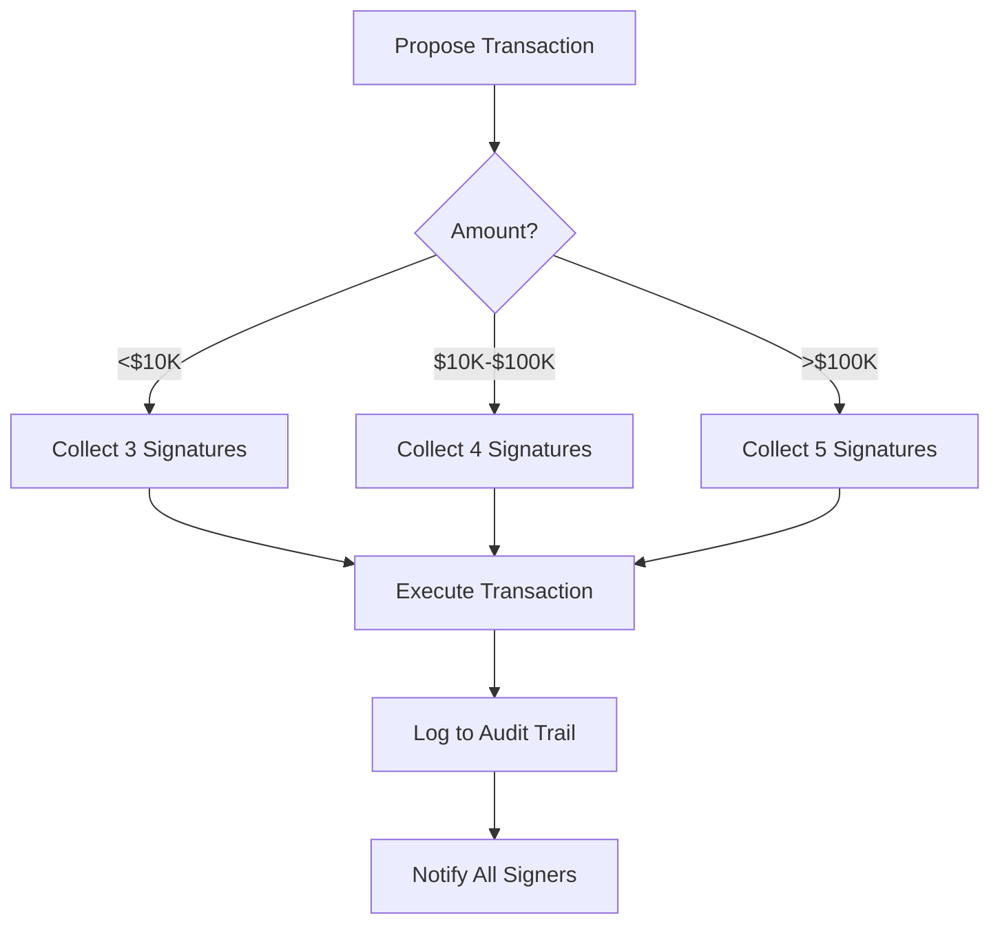
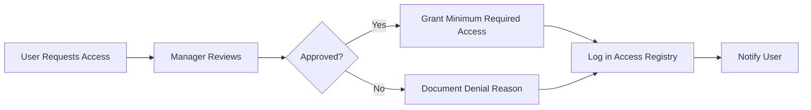

# Access Control Framework
**RBAC Implementation for Strategickhaos DAO LLC**

> **INTERNAL DRAFT — NOT LEGAL ADVICE — ATTORNEY REVIEW REQUIRED**
> 
> This framework establishes role-based access control (RBAC) policies across all organizational systems including GitHub, cryptocurrency wallets, and infrastructure.

## Executive Summary

Strict access controls are critical for preventing unauthorized access, insider threats, and security breaches. This framework implements defense-in-depth with multisig wallets, GitHub RBAC, and OpenZeppelin Defender monitoring.

**Status**: Implementation Phase  
**Priority**: Critical Security Control  
**Timeline**: 14 days to full implementation

---

## Access Control Principles

### Core Tenets

1. **Least Privilege**: Users granted minimum access needed for their role
2. **Separation of Duties**: Critical actions require multiple approvers
3. **Defense in Depth**: Multiple layers of security controls
4. **Regular Review**: Quarterly access audits and adjustments
5. **Audit Everything**: Comprehensive logging of all access and changes

### Zero Trust Model

- **Verify Always**: Never assume trust based on network location
- **Explicit Permission**: All access must be explicitly granted
- **Assume Breach**: Design controls as if adversary already inside
- **Least Privilege**: Minimize blast radius of any compromise

---

## Organizational Roles

### Role Definitions

| Role | Description | Trust Level | Count |
|------|-------------|-------------|-------|
| **Founder** | Primary decision maker | Highest | 1 |
| **Core Team** | Full-time contributors | High | 3-5 |
| **Contributors** | Regular contributors | Medium | 10-20 |
| **Community** | General community members | Low | Unlimited |
| **Service Accounts** | Automated systems | Varies | As needed |

### Permission Matrix

```yaml
permissions:
  github:
    founder:
      - admin
      - write
      - deploy
      - settings
    core_team:
      - write
      - review
      - deploy_staging
    contributors:
      - write
      - create_pr
    community:
      - read
      - create_issue
      - comment
      
  wallets:
    founder:
      - multisig_signer
      - propose_transaction
    core_team:
      - multisig_signer
      - propose_transaction
    contributors:
      - receive_only
    community:
      - none
      
  infrastructure:
    founder:
      - full_access
    core_team:
      - deploy
      - monitor
      - restart
    contributors:
      - monitor_only
    community:
      - none
```

---

## Gnosis-Safe Multisig Configuration

### Wallet Structure

```yaml
treasury_multisig:
  type: Gnosis Safe
  network: Ethereum Mainnet
  threshold: 3-of-5
  signers:
    - founder_wallet (Founder)
    - core_team_1 (Core Team)
    - core_team_2 (Core Team)
    - core_team_3 (Core Team)
    - trusted_advisor (External)
  transaction_limits:
    - <$10,000: 3-of-5 signatures
    - ≥$10,000: 4-of-5 signatures
    - ≥$100,000: 5-of-5 signatures (unanimous)

operations_multisig:
  type: Gnosis Safe
  network: Polygon
  threshold: 2-of-3
  signers:
    - founder_wallet (Founder)
    - core_team_1 (Core Team)
    - core_team_2 (Core Team)
  purpose: Daily operations, lower value transactions
  
emergency_multisig:
  type: Gnosis Safe
  network: Ethereum Mainnet
  threshold: 3-of-3
  signers:
    - founder_wallet (Founder)
    - legal_counsel (Attorney)
    - board_member (Board)
  purpose: Emergency actions, contract pauses
```

### Setup Procedure

```bash
#!/bin/bash
# setup-gnosis-safe.sh - Gnosis Safe deployment and configuration

# 1. Install Gnosis Safe CLI
npm install -g @gnosis.pm/safe-cli

# 2. Connect wallet and deploy Safe
safe-cli create \
  --owners 0xFounder,0xCore1,0xCore2,0xCore3,0xAdvisor \
  --threshold 3 \
  --network mainnet

# 3. Verify deployment
SAFE_ADDRESS="0x..." # Address from deployment
safe-cli info $SAFE_ADDRESS --network mainnet

# 4. Fund the Safe
# Transfer initial funds to SAFE_ADDRESS

# 5. Enable modules (if needed)
# safe-cli enable-module $SAFE_ADDRESS $MODULE_ADDRESS --network mainnet
```

### Transaction Workflow



### Transaction Signing SOP

1. **Proposal**: Any signer creates transaction proposal in Gnosis Safe UI
2. **Notification**: Automated notifications sent to all signers
3. **Review**: Signers review transaction details and supporting documentation
4. **Verification**: Out-of-band confirmation (Discord, Signal) for large transactions
5. **Signing**: Signers approve via hardware wallet or mobile wallet
6. **Execution**: Once threshold met, transaction executed automatically
7. **Recording**: Transaction logged and reported to board monthly

---

## OpenZeppelin Defender Setup

### Defender Components

```yaml
defender_config:
  admin:
    contracts:
      - name: $CHAOS Token
        address: 0x...
        network: mainnet
      - name: NFT Collection
        address: 0x...
        network: mainnet
    multisig: ${GNOSIS_SAFE_ADDRESS}
    
  sentinel:
    monitors:
      - name: Large Transfers
        type: event
        event: Transfer(address,address,uint256)
        condition: value > 100000 * 10^18
        notification: discord, email
        
      - name: Contract Pause
        type: event
        event: Paused(address)
        notification: discord, pagerduty
        
      - name: Ownership Transfer
        type: event
        event: OwnershipTransferred(address,address)
        notification: all_channels
        
  relay:
    enabled: true
    purpose: Gasless meta-transactions
    
  autotask:
    tasks:
      - name: Daily Balance Check
        schedule: "0 0 * * *"
        action: check_treasury_balance
        
      - name: Security Health Check
        schedule: "0 */6 * * *"
        action: run_security_checks
```

### Implementation Steps

1. **Create Defender Account**:
   ```bash
   # Sign up at https://defender.openzeppelin.com
   # Connect wallet and verify email
   ```

2. **Add Contracts**:
   ```javascript
   // defender-add-contracts.js
   const { AdminClient } = require('defender-admin-client');
   
   const client = new AdminClient({
     apiKey: process.env.DEFENDER_API_KEY,
     apiSecret: process.env.DEFENDER_API_SECRET,
   });
   
   await client.addContract({
     network: 'mainnet',
     address: '0xTOKEN_ADDRESS',
     name: '$CHAOS Token',
     abi: [...],
   });
   ```

3. **Configure Monitors**:
   - Set up event monitoring for critical functions
   - Configure notification channels (Discord, email, PagerDuty)
   - Test alerts with dummy transactions
   - Document escalation procedures

4. **Set Up Autotasks**:
   ```javascript
   // autotask-balance-check.js
   const { ethers } = require('ethers');
   
   exports.handler = async function(credentials) {
     const provider = new ethers.providers.JsonRpcProvider(credentials.rpcUrl);
     const balance = await provider.getBalance(SAFE_ADDRESS);
     
     if (balance < MIN_BALANCE) {
       // Trigger low balance alert
       await notifyDiscord("⚠️ Treasury balance below threshold");
     }
   }
   ```

---

## GitHub Organization RBAC

### Team Structure

```yaml
github_org: Strategickhaos-Swarm-Intelligence

teams:
  admins:
    members: [founder, core_team_lead]
    permissions:
      - org_admin
      - repo_admin
      - manage_teams
      - manage_webhooks
      
  core-developers:
    members: [core_team_1, core_team_2, core_team_3]
    permissions:
      - write
      - deploy_staging
      - manage_branches
      - review_required: 1
      
  contributors:
    members: [contributor_1, contributor_2, ...]
    permissions:
      - write
      - create_pr
      - review_required: 2
      
  community:
    members: public
    permissions:
      - read
      - create_issue
      - comment
```

### Repository Settings

```yaml
branch_protection:
  main:
    required_reviews: 2
    required_status_checks:
      - ci/tests
      - security/scan
      - linter
    enforce_admins: true
    dismiss_stale_reviews: true
    require_code_owner_review: true
    require_linear_history: true
    allow_force_pushes: false
    allow_deletions: false
    
  staging:
    required_reviews: 1
    required_status_checks:
      - ci/tests
    enforce_admins: false
    
security:
  secret_scanning: enabled
  dependabot:
    enabled: true
    automerge: security_only
  code_scanning:
    tool: codeql
    schedule: daily
    
access:
  require_2fa: true
  sso_required: false # Consider enabling with identity provider
  verified_domains: [strategickhaos.org]
```

### Implementation Script

```bash
#!/bin/bash
# setup-github-rbac.sh - Configure GitHub organization security

ORG="Strategickhaos-Swarm-Intelligence"
REPO="Sovereignty-Architecture-Elevator-Pitch-"

# 1. Enable security features
gh api -X PATCH "/repos/$ORG/$REPO" \
  -f security_and_analysis[secret_scanning][status]=enabled \
  -f security_and_analysis[secret_scanning_push_protection][status]=enabled

# 2. Configure branch protection
gh api -X PUT "/repos/$ORG/$REPO/branches/main/protection" \
  -F required_status_checks[strict]=true \
  -F required_status_checks[contexts][]=ci/tests \
  -F required_pull_request_reviews[required_approving_review_count]=2 \
  -F required_pull_request_reviews[dismiss_stale_reviews]=true \
  -F enforce_admins=true \
  -F restrictions=null

# 3. Require 2FA
gh api -X PATCH "/orgs/$ORG" \
  -F two_factor_requirement_enabled=true

# 4. Create teams and assign permissions
gh api -X PUT "/orgs/$ORG/teams/core-developers/repos/$ORG/$REPO" \
  -F permission=push

echo "✓ GitHub RBAC configuration complete"
```

---

## Access Request & Revocation

### Access Request Process



### Request Template

```yaml
# access-request.yaml
requester: username
requested_access:
  system: GitHub / Gnosis Safe / Infrastructure
  level: read / write / admin
  repositories: [list of repos]
  duration: permanent / temporary (end date)
  
justification: |
  Detailed explanation of why access is needed
  and what tasks require this level of access.
  
manager_approval: pending
security_review: pending
date_requested: YYYY-MM-DD
```

### Revocation Triggers

Access is automatically revoked upon:
- Employee/contributor termination or resignation
- Role change to position not requiring access
- 90 days of inactivity (for non-core team)
- Security incident involving the account
- Temporary access expiration
- Request by the user

### Offboarding Checklist

- [ ] Remove from all GitHub teams
- [ ] Remove as Gnosis Safe signer (if applicable)
- [ ] Revoke infrastructure access (SSH keys, VPN, etc.)
- [ ] Disable API keys and service accounts
- [ ] Remove from communication channels (Discord admin roles)
- [ ] Retrieve hardware tokens or access devices
- [ ] Document knowledge transfer
- [ ] Archive user's work and access history
- [ ] Send exit confirmation to user

---

## Monitoring & Auditing

### Access Audit Schedule

```yaml
audit_frequency:
  daily:
    - Review failed login attempts
    - Check for new users or permission changes
    - Monitor high-privilege actions
    
  weekly:
    - Review all access grants from past week
    - Verify multisig signer activity
    - Check for dormant accounts
    
  monthly:
    - Full access review for all users
    - Verify role assignments are appropriate
    - Review and update access control policies
    
  quarterly:
    - Comprehensive security audit
    - Penetration testing of access controls
    - Update RBAC documentation
    - Train team on security best practices
```

### Audit Logging

```yaml
log_requirements:
  what_to_log:
    - All authentication attempts (success and failure)
    - Permission changes
    - Multisig transactions (proposed, signed, executed)
    - Smart contract function calls
    - Administrative actions
    - Access grants and revocations
    
  retention: 7 years (IRS compliance)
  
  storage:
    - Primary: CloudWatch / Loki
    - Backup: S3 / Arweave (immutable)
    - Encryption: AES-256 at rest
    
  access:
    - Founder: full access
    - Security team: read-only
    - Auditors: time-limited read access
```

### Security Metrics

```yaml
kpis:
  access_control:
    - Failed login attempts per day (target: <10)
    - Average time to revoke access (target: <24 hours)
    - Percentage of users with 2FA (target: 100%)
    - Audit findings per review (target: <5)
    
  multisig:
    - Average transaction approval time (target: <48 hours)
    - Percentage of transactions requiring escalation (target: <5%)
    - Signer participation rate (target: >90%)
    
  compliance:
    - Quarterly access audits completed on time (target: 100%)
    - Training completion rate (target: 100%)
    - Policy violations per quarter (target: 0)
```

---

## Incident Response

### Security Incident Classification

| Level | Description | Response Time | Examples |
|-------|-------------|---------------|----------|
| **P0 - Critical** | Active breach or compromise | <15 minutes | Wallet drained, GitHub admin compromised |
| **P1 - High** | Potential compromise | <1 hour | Suspicious multisig transaction, failed logins |
| **P2 - Medium** | Policy violation | <4 hours | Unauthorized access attempt, policy breach |
| **P3 - Low** | Informational | <24 hours | Inactive account, minor policy deviation |

### Incident Response Procedures

**P0 - Critical Incident**:
1. **Contain** (0-15 min): Pause affected contracts, revoke compromised access
2. **Assess** (15-30 min): Determine scope and impact
3. **Communicate** (30-60 min): Alert all stakeholders, public disclosure if needed
4. **Remediate** (1-24 hours): Fix vulnerability, restore services
5. **Post-Mortem** (1 week): Document incident, improve controls

**Communication Template**:
```markdown
## Security Incident Alert

**Severity**: P0 - Critical
**Time**: 2025-11-23 14:30 UTC
**Status**: Contained

### What Happened
[Brief description of incident]

### Impact
[Who/what is affected]

### Actions Taken
[Steps taken to contain and resolve]

### Next Steps
[What users should do, timeline for resolution]

### Updates
[Link to status page for ongoing updates]
```

---

## Training & Awareness

### Security Training Program

```yaml
training_schedule:
  onboarding:
    - Security fundamentals (2 hours)
    - Access control policies (1 hour)
    - Phishing awareness (1 hour)
    - Incident reporting (30 minutes)
    
  annual_refresher:
    - Policy updates (1 hour)
    - Threat landscape review (1 hour)
    - Hands-on security exercises (2 hours)
    
  role_specific:
    multisig_signers:
      - Hardware wallet usage (1 hour)
      - Transaction verification (1 hour)
      - Social engineering awareness (1 hour)
    
    github_admins:
      - Repository security settings (1 hour)
      - Code review for security (2 hours)
      - Secrets management (1 hour)
```

### Security Awareness

- Monthly security tips in Discord
- Quarterly phishing simulations
- Annual security week with talks and workshops
- Rewards program for security issue reporting

---

## Success Metrics

### Implementation Success (Days 1-14)

- [ ] Gnosis Safe deployed and funded
- [ ] All signers onboarded with hardware wallets
- [ ] OpenZeppelin Defender configured with monitors
- [ ] GitHub RBAC implemented with 2FA required
- [ ] Access audit log system operational
- [ ] Incident response procedures documented
- [ ] Team trained on new procedures

### Ongoing Health

- [ ] 100% of users with 2FA enabled
- [ ] <1 hour average time to grant access
- [ ] <24 hour average time to revoke access
- [ ] Zero critical security incidents
- [ ] 100% quarterly audit completion rate
- [ ] >95% team training completion

---

## Resources

### Tools
- Gnosis Safe: https://gnosis-safe.io
- OpenZeppelin Defender: https://defender.openzeppelin.com
- GitHub Security: https://docs.github.com/en/security

### Documentation
- See: `/governance/access_control/policies/` for detailed policies
- See: `/governance/access_control/procedures/` for SOPs
- See: `/governance/access_control/training/` for training materials

---

## Document Control

| Field | Value |
|-------|-------|
| Version | 1.0 |
| Status | Implementation Phase |
| Owner | Strategickhaos DAO LLC |
| Security Review | Required |
| Created | 2025-11-23 |
| Next Review | Monthly |

---

*© 2025 Strategickhaos DAO LLC. Internal use only.*
