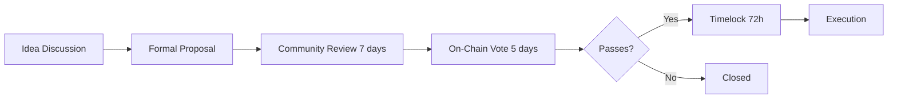

# $CHAOS Token Framework
**Community Governance Token for Strategickhaos DAO LLC**

> **INTERNAL DRAFT — NOT LEGAL ADVICE — ATTORNEY REVIEW REQUIRED**
> 
> This document contains planning materials for a potential token launch. Securities law compliance review is mandatory before any token issuance.

## Executive Summary

The $CHAOS token is designed as a community governance and utility token for the Strategickhaos ecosystem. This framework prioritizes legal compliance, long-term sustainability, and authentic community value over short-term speculation.

**Status**: Design Phase  
**Legal Review Required**: Securities attorney consultation mandatory  
**Regulatory Strategy**: Utility token approach with clear non-security characteristics  
**Expected Timeline**: 4-6 weeks from legal approval to launch

---

## Token Design Philosophy

### Core Principles

1. **Utility First**: Token must have clear, present utility beyond speculation
2. **Community Owned**: No pre-mine, no insider allocations, fair launch
3. **Transparent**: All tokenomics publicly documented and verifiable on-chain
4. **Compliant**: Designed to avoid securities classification under Howey Test
5. **Sustainable**: Deflationary mechanisms and long-term value accrual

### Why "CHAOS"?

Strategic Chaos represents the transformation of disorder into productive order. The token embodies:
- **C**ommunity governance and coordination
- **H**onest, transparent operations
- **A**utonomous, decentralized decision-making
- **O**pen source development and collaboration
- **S**overeign, censorship-resistant infrastructure

---

## Tokenomics

### Supply Model

```
Total Supply: 1,000,000,000 $CHAOS (1 billion)
Initial Circulating: 250,000,000 $CHAOS (25%)
Distribution: 100% Fair Launch (No Pre-mine)
```

### Distribution Breakdown

| Allocation | Amount | % | Vesting | Purpose |
|------------|--------|---|---------|---------|
| **Fair Launch** | 250M | 25% | Immediate | Public liquidity and community distribution |
| **Community Treasury** | 400M | 40% | Time-locked | Grants, incentives, ecosystem growth |
| **DAO Reserve** | 200M | 20% | 4-year vest | Long-term sustainability and operations |
| **Contributor Rewards** | 100M | 10% | 2-year vest | Team and contributor compensation |
| **Liquidity Incentives** | 50M | 5% | 1-year vest | LP rewards and market making |

### No Pre-Mine Guarantee

- **Zero** tokens allocated before public launch
- **Zero** insider or "friends & family" rounds
- **All** team tokens subject to long-term vesting
- **100%** transparent allocation on-chain

---

## Utility Functions

### Governance Rights

```yaml
governance_powers:
  treasury_allocation:
    threshold: 100,000 $CHAOS minimum stake
    vote_weight: 1 token = 1 vote
    
  protocol_upgrades:
    threshold: 1,000,000 $CHAOS for proposal
    quorum: 10% of circulating supply
    approval: 60% supermajority
    
  grants_approval:
    threshold: 10,000 $CHAOS to vote
    delegation: allowed
    
  emergency_actions:
    threshold: 5% of supply for proposal
    approval: 80% supermajority
    timelock: 72 hours minimum
```

### Platform Access

- **Premium Features**: Access to advanced Discord bot commands
- **Priority Support**: Queue priority for AI agent interactions
- **Early Access**: Beta testing of new features and tools
- **Exclusive Content**: Educational materials and research reports

### Economic Utility

- **Transaction Fees**: Optional $CHAOS payment for reduced platform fees
- **Staking Rewards**: Earn yield by staking $CHAOS in liquidity pools
- **NFT Minting**: Required for NFT land purchases in ecosystem
- **Service Payment**: Payment option for consulting and services

---

## Security & Compliance

### Howey Test Analysis

To avoid securities classification, $CHAOS is designed with:

1. **No Investment Contract**: Token purchase is not an investment in the enterprise
2. **Present Utility**: Immediate use cases from day one, not future promises
3. **No Profit Expectation**: Utility-focused marketing, not ROI promises
4. **Decentralized Effort**: Community-driven, not dependent on central team
5. **Token Burn**: Deflationary model removes expectation of management increasing value

### Legal Safeguards

- [ ] Securities attorney review of token design
- [ ] Opinion letter on non-security status (if possible)
- [ ] Clear disclaimers on all marketing materials
- [ ] No promises of future value or returns
- [ ] Restrict sales in certain jurisdictions if needed
- [ ] KYC/AML for large purchases (if required)

### Smart Contract Security

```yaml
security_requirements:
  audit:
    - provider: Trail of Bits (or equivalent)
    - scope: Full token contract and governance
    - report: Published unredacted
    
  testing:
    - coverage: 100% of critical functions
    - formal_verification: Yes for token transfers
    - testnet_duration: 2 weeks minimum
    
  features:
    - pausable: Emergency pause by multisig
    - upgradeable: Proxy pattern with timelock
    - max_supply: Immutable hard cap
    - burn_function: Deflationary mechanism
```

---

## Launch Strategy

### Phase 1: Fair Launch (Week 1)

```yaml
fair_launch:
  mechanism: Bonding curve or Balancer LBP
  initial_price: $0.001 per $CHAOS
  max_per_wallet: 1,000,000 $CHAOS (0.1% of supply)
  duration: 72 hours
  liquidity: 50% to liquidity pool, 50% to DAO treasury
```

**Anti-Bot Measures**:
- Transaction delays between buys
- Maximum purchase per block
- Human verification for large purchases
- Gradual price curve to discourage sniping

### Phase 2: Liquidity Provision (Week 2)

- Deploy 50M $CHAOS + paired assets to Uniswap/Sushiswap
- Liquidity pool tokens locked for 6 months minimum
- LP incentive program launched
- Market making partnerships established

### Phase 3: Ecosystem Integration (Weeks 3-4)

- Governance portal launched
- Staking contracts deployed
- First governance proposals
- Integration with Discord bot features

### Phase 4: Sustained Growth (Month 2+)

- Regular community calls and updates
- Quarterly token burns from fee revenue
- Grant program launched for ecosystem projects
- Exchange listing considerations (DEX first, CEX later)

---

## Governance Framework

### Proposal Process



### Voting Parameters

```yaml
governance_config:
  proposal_threshold: 1,000,000 $CHAOS (0.1% of supply)
  voting_period: 5 days
  voting_delay: 2 days (anti-sniping)
  quorum: 10% of circulating supply
  approval_threshold: 60% (simple proposals)
  critical_threshold: 80% (protocol changes)
  timelock: 72 hours minimum (emergency: 24h)
```

### Governance Powers

**Treasury Management**:
- Approve spending above $10,000
- Allocate grants to projects
- Approve major partnerships

**Protocol Changes**:
- Update fee structures
- Add/remove platform features
- Upgrade smart contracts

**Community Actions**:
- Approve new token integrations
- Vote on ecosystem priorities
- Elect/remove moderators or council members

---

## Deflationary Mechanisms

### Token Burns

```yaml
burn_sources:
  platform_fees:
    percentage: 50% of all platform fees
    frequency: Monthly
    
  transaction_tax:
    rate: 0.1% on transfers (optional)
    destination: Burn address
    
  nft_minting:
    amount: 1,000 $CHAOS per NFT mint
    destination: Burn address
    
  buyback_program:
    frequency: Quarterly
    source: DAO revenue
    amount: Up to 5% of treasury
```

**Target**: Reduce supply to 500M $CHAOS within 5 years through organic burns.

---

## Risk Disclosures

### Market Risks

⚠️ **High Volatility**: Cryptocurrency prices can fluctuate dramatically  
⚠️ **Liquidity Risk**: Low liquidity could prevent selling at desired prices  
⚠️ **Market Manipulation**: Whale actions could impact price  
⚠️ **Zero Value Risk**: Token could theoretically lose all value

### Technology Risks

⚠️ **Smart Contract Bugs**: Despite audits, unknown vulnerabilities may exist  
⚠️ **Blockchain Risks**: Underlying blockchain could have issues  
⚠️ **Oracle Failures**: External data feeds could malfunction  
⚠️ **Upgrades**: Protocol changes could introduce new risks

### Regulatory Risks

⚠️ **Securities Classification**: Regulatory determination could classify token as security  
⚠️ **Jurisdictional Bans**: Some countries may prohibit token ownership  
⚠️ **Tax Treatment**: Tax obligations vary by jurisdiction and could be unfavorable  
⚠️ **Compliance Costs**: Future regulations could increase operational costs

### Project Risks

⚠️ **Team Departure**: Key contributors could leave the project  
⚠️ **Development Failure**: Planned features may not be delivered  
⚠️ **Competition**: Other projects could outcompete for users  
⚠️ **Funding**: Organization could run out of resources

**Important**: These risks are disclosed transparently. Do not purchase $CHAOS as an investment. Only acquire $CHAOS if you intend to use it for its utility purposes within the ecosystem.

---

## Compliance Checklist

### Pre-Launch Requirements

- [ ] Securities attorney review and opinion letter
- [ ] Howey Test analysis documentation
- [ ] Terms of service and disclaimers prepared
- [ ] KYC/AML procedures (if required)
- [ ] Restricted jurisdiction list (if needed)
- [ ] Smart contract audit completed
- [ ] Testnet deployment and testing (2 weeks minimum)
- [ ] Community education on risks
- [ ] Marketing materials reviewed for securities law compliance

### Post-Launch Requirements

- [ ] Ongoing legal monitoring of regulatory developments
- [ ] Quarterly compliance reviews
- [ ] Annual financial reporting (integrated with 501c3 reporting)
- [ ] Community transparency reports
- [ ] Regular security audits

---

## Marketing & Community

### Messaging Focus

**DO**:
✅ Emphasize utility and governance features  
✅ Discuss technology and innovation  
✅ Highlight community ownership  
✅ Explain current use cases  
✅ Showcase transparency

**DON'T**:
❌ Promise price appreciation  
❌ Suggest "investment opportunity"  
❌ Compare to traditional securities  
❌ Make ROI projections  
❌ Create FOMO or urgency

### Community Building

- **Education First**: Comprehensive documentation and tutorials
- **Transparency**: Monthly DAO treasury and burn reports
- **Engagement**: Regular AMAs and community calls
- **Recognition**: Contributor badges and roles
- **Long-term**: Focus on multi-year vision, not quick gains

---

## Success Metrics

### Launch Success (Month 1)

- [ ] Fair launch completed with no technical issues
- [ ] 1,000+ unique token holders
- [ ] $100K+ liquidity pool established
- [ ] Zero securities law violations or complaints
- [ ] Active governance participation (first proposals)

### Growth Metrics (Months 2-6)

- [ ] 10,000+ token holders
- [ ] 100+ governance proposals and votes
- [ ] $1M+ in treasury from platform fees
- [ ] First quarterly token burn completed
- [ ] 50+ active community contributors

### Long-term Health (Year 1+)

- [ ] Sustained utility adoption across platform
- [ ] Regular governance activity (healthy DAO)
- [ ] Treasury growth supporting operations
- [ ] Token distribution becoming more decentralized
- [ ] No regulatory issues or legal challenges

---

## Resources

### Legal
- Howey Test Analysis Templates
- Token Legal Opinion Letter Requirements
- SEC Digital Asset Framework

### Technical
- OpenZeppelin Governance Contracts
- Trail of Bits Token Audit Checklist
- DeFi Security Best Practices

### Market
- Fair Launch Strategies
- Community Building Playbooks
- Tokenomics Design Patterns

---

## Document Control

| Field | Value |
|-------|-------|
| Version | 1.0 |
| Status | Design Phase |
| Owner | Strategickhaos DAO LLC |
| Legal Review | **REQUIRED BEFORE LAUNCH** |
| Created | 2025-11-23 |
| Next Review | Upon Securities Attorney Engagement |

---

**CRITICAL REMINDER**: This framework is for planning purposes only. **NO TOKEN MAY BE ISSUED** without comprehensive securities law review by qualified legal counsel. The organization commits to full legal compliance before any token launch.

---

*© 2025 Strategickhaos DAO LLC. Internal use only.*
