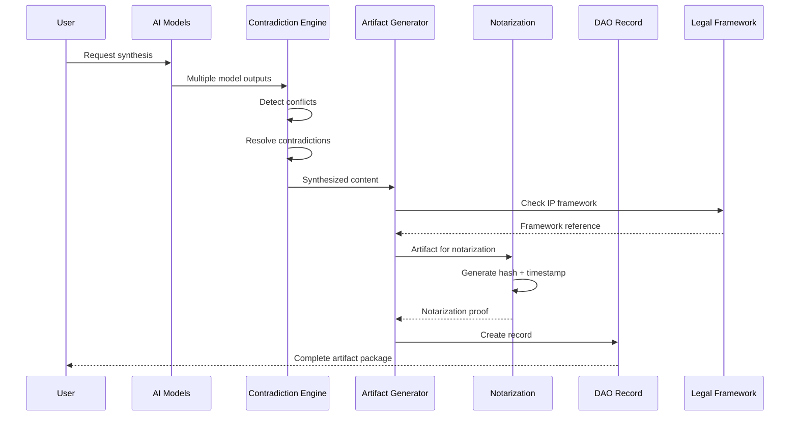

# STRATEGICKHAOS COGNITIVE-LEGAL ARCHITECTURE SPECIFICATION
## Technical-Legal Stack Documentation
### Bridging Cognition to Compliance

---

**Document ID:** SPEC-COGNITIVE-LEGAL-2025-001  
**Version:** 1.0.0  
**Classification:** Technical Architecture Specification  
**IP Framework:** [DECLARATION-2025-12-02.md](./DECLARATION-2025-12-02.md)  
**Status:** ACTIVE  

---

## ABSTRACT

This specification defines the formal architecture bridging StrategicKhaos cognitive systems (AI synthesis engines, contradiction resolution, multi-model fusion) with legal frameworks (Wyoming DAO law, IP protection, compliance automation). It serves as the canonical reference for implementing cognitive-legal integration across all StrategicKhaos products.

---

## SECTION I: ARCHITECTURE OVERVIEW

### 1.1 System Boundary Definition
```
╔═══════════════════════════════════════════════════════════════╗
║               COGNITIVE-LEGAL ARCHITECTURE                    ║
╠═══════════════════════════════════════════════════════════════╣
║                                                               ║
║  ┌─────────────────────────────────────────────────────────┐  ║
║  │              COGNITIVE DOMAIN                           │  ║
║  │                                                         │  ║
║  │  ┌─────────────┐  ┌─────────────┐  ┌─────────────┐     │  ║
║  │  │   GPT-4     │  │  Claude 3.5 │  │   Ollama    │     │  ║
║  │  │   Output    │  │   Output    │  │   Output    │     │  ║
║  │  └──────┬──────┘  └──────┬──────┘  └──────┬──────┘     │  ║
║  │         │                │                │            │  ║
║  │         └────────────────┼────────────────┘            │  ║
║  │                          ▼                             │  ║
║  │           ┌──────────────────────────────┐             │  ║
║  │           │   CONTRADICTION ENGINE       │             │  ║
║  │           │   (contradiction-engine.sh)  │             │  ║
║  │           └──────────────┬───────────────┘             │  ║
║  │                          │                             │  ║
║  └──────────────────────────┼─────────────────────────────┘  ║
║                             │                                ║
║  ┌──────────────────────────┼─────────────────────────────┐  ║
║  │           BRIDGE LAYER   │  (This Specification)       │  ║
║  │                          ▼                             │  ║
║  │           ┌──────────────────────────────┐             │  ║
║  │           │   ARTIFACT GENERATOR         │             │  ║
║  │           │   (Versioned, Timestamped)   │             │  ║
║  │           └──────────────┬───────────────┘             │  ║
║  │                          │                             │  ║
║  │    ┌─────────────────────┼─────────────────────────┐   │  ║
║  │    │                     │                         │   │  ║
║  │    ▼                     ▼                         ▼   │  ║
║  │ ┌──────────┐      ┌──────────────┐         ┌────────┐  │  ║
║  │ │DAO Record│      │ Notarization │         │ Graph  │  │  ║
║  │ │Generator │      │   Pipeline   │         │ Render │  │  ║
║  │ └──────────┘      └──────────────┘         └────────┘  │  ║
║  │                                                        │  ║
║  └────────────────────────────────────────────────────────┘  ║
║                             │                                ║
║  ┌──────────────────────────┼─────────────────────────────┐  ║
║  │             LEGAL DOMAIN │                             │  ║
║  │                          ▼                             │  ║
║  │  ┌─────────────────────────────────────────────────┐   │  ║
║  │  │            DECLARATION-2025-12-02               │   │  ║
║  │  │         (IP Framework Foundation)               │   │  ║
║  │  └─────────────────────────────────────────────────┘   │  ║
║  │                                                        │  ║
║  │  ┌───────────────┐  ┌───────────────┐  ┌───────────┐   │  ║
║  │  │ Wyoming DAO   │  │ 501(c)(3)     │  │ UPL       │   │  ║
║  │  │ (SF0068)      │  │ Research      │  │ Compliance│   │  ║
║  │  └───────────────┘  └───────────────┘  └───────────┘   │  ║
║  │                                                        │  ║
║  └────────────────────────────────────────────────────────┘  ║
║                                                               ║
╚═══════════════════════════════════════════════════════════════╝
```

### 1.2 Design Principles

1. **Bidirectional Flow**: Legal constraints inform cognitive processing; cognitive outputs generate legal artifacts
2. **Immutability at Rest**: Once notarized, artifacts cannot be modified without new version
3. **Traceability**: Every cognitive output links to legal framework
4. **Automation First**: Manual legal compliance is error-prone; automate everything
5. **Defense in Depth**: Multiple validation layers before artifact finalization

---

## SECTION II: COMPONENT SPECIFICATIONS

### 2.1 Contradiction Engine Interface

**Purpose**: Synthesize outputs from multiple AI models into coherent artifacts

**Input Specification**:
```typescript
interface ContradictionEngineInput {
  sources: {
    model: string;           // "gpt-4", "claude-3.5", "ollama/mixtral"
    output: string;          // Raw text output
    timestamp: ISO8601;      // When generated
    confidence?: number;     // 0-1 optional confidence score
  }[];
  synthesisMode: "merge" | "select" | "hybrid";
  ipFramework: string;       // Path to declaration document
  options?: {
    conflictResolution: "newest" | "highest-confidence" | "vote";
    preserveContradictions: boolean;  // Log unresolved conflicts
  };
}
```

**Output Specification**:
```typescript
interface ContradictionEngineOutput {
  synthesizedContent: string;
  metadata: {
    sourceCount: number;
    conflictsDetected: number;
    conflictsResolved: number;
    synthesisTimestamp: ISO8601;
  };
  audit: {
    inputHashes: string[];
    outputHash: string;
    ipFrameworkRef: string;
  };
}
```

**CLI Usage**:
```bash
./contradiction-engine.sh \
  --input1 gpt_output.txt \
  --input2 claude_output.txt \
  --mode hybrid \
  --ip-framework "legal/DECLARATION-2025-12-02.md" \
  --output synthesized.md
```

### 2.2 DAO Record Generator Interface

**Purpose**: Create formal, auditable records of organizational decisions and artifacts

**Input Specification**:
```typescript
interface DAORecordInput {
  topic: string;              // Subject of the record
  decision: string;           // Decision or action taken
  ipFramework: string;        // Path to declaration document
  metadata?: {
    participants?: string[];  // Decision participants
    voteTally?: {
      for: number;
      against: number;
      abstain: number;
    };
    effectiveDate?: ISO8601;
    expirationDate?: ISO8601;
  };
}
```

**Output**: YAML file conforming to `dao_record.yaml` schema

**CLI Usage**:
```bash
./generate_dao_record.sh \
  --topic "Sovereign Compute Architecture v1.0" \
  --decision "Approved for deployment" \
  --ip-framework "legal/DECLARATION-2025-12-02.md"
```

### 2.3 Notarization Pipeline Interface

**Purpose**: Create cryptographic proof of artifact existence at specific timestamp

**Input Specification**:
```typescript
interface NotarizationInput {
  artifact: string;           // Path to file or directory
  session: string;            // Session identifier for grouping
  options?: {
    ipfs: boolean;            // Pin to IPFS network
    ots: boolean;             // Create OpenTimestamps proof
    blockchain?: string;      // Optional blockchain anchor
  };
}
```

**Output Specification**:
```typescript
interface NotarizationOutput {
  sha256: string;             // Artifact hash
  timestamp: ISO8601;         // Notarization timestamp
  ipfsHash?: string;          // CID if IPFS enabled
  otsFile?: string;           // Path to .ots proof file
  manifestPath: string;       // Path to notarization manifest
}
```

**CLI Usage**:
```bash
./notarize_cognition.sh \
  --session "roadmap-v1" \
  --artifact "legal/SOVEREIGN_COMPUTE_ROADMAP_v1.0.md"
```

---

## SECTION III: DATA FLOW SPECIFICATIONS

### 3.1 Artifact Lifecycle

```
┌─────────────────────────────────────────────────────────────┐
│                    ARTIFACT LIFECYCLE                       │
├─────────────────────────────────────────────────────────────┤
│                                                             │
│  1. CREATION          2. SYNTHESIS        3. VALIDATION     │
│  ───────────          ───────────         ──────────────    │
│  ┌─────────┐          ┌─────────┐         ┌─────────┐       │
│  │ Raw AI  │ ──────▶  │ Merged  │ ──────▶ │ Schema  │       │
│  │ Outputs │          │ Content │         │ Check   │       │
│  └─────────┘          └─────────┘         └─────────┘       │
│                                                  │          │
│  4. ATTRIBUTION       5. NOTARIZATION    6. REGISTRATION   │
│  ──────────────       ───────────────    ─────────────────  │
│  ┌─────────┐          ┌─────────┐         ┌─────────┐       │
│  │ IP      │ ◀──────  │ Crypto  │ ──────▶ │ DAO     │       │
│  │ Header  │          │ Proof   │         │ Record  │       │
│  └─────────┘          └─────────┘         └─────────┘       │
│                                                  │          │
│  7. STORAGE           8. INDEXING        9. ARCHIVAL       │
│  ──────────           ───────────        ─────────────      │
│  ┌─────────┐          ┌─────────┐         ┌─────────┐       │
│  │ Git     │ ──────▶  │ Search  │ ──────▶ │ IPFS/   │       │
│  │ Commit  │          │ Index   │         │ Archive │       │
│  └─────────┘          └─────────┘         └─────────┘       │
│                                                             │
└─────────────────────────────────────────────────────────────┘
```

### 3.2 Event Flow Diagram



---

## SECTION IV: LEGAL BINDING MECHANISMS

### 4.1 IP Attribution Protocol
Every artifact generated through this system MUST include:

```markdown
---
Attribution: StrategicKhaos DAO LLC (2025-001708194)
IP Framework: DECLARATION-2025-12-02.md
Generated: {{ISO8601_TIMESTAMP}}
Hash: {{SHA256_HASH}}
---
```

### 4.2 Wyoming SF0068 Compliance Mapping

| SF0068 Requirement | System Implementation |
|-------------------|----------------------|
| Smart contract capability | DAO Record Generator |
| Member voting | `uidp_vote.py` |
| Algorithmic governance | Contradiction Engine rules |
| Audit trail | Notarization pipeline |
| Legal entity status | DECLARATION linkage |

### 4.3 UPL (Unauthorized Practice of Law) Safeguards

```yaml
upl_safeguards:
  automated_disclaimers:
    - "This system does not provide legal advice"
    - "Consult qualified counsel for legal matters"
  
  attorney_gates:
    - action: "legal_document_generation"
      requires: "attorney_review"
    - action: "compliance_certification"
      requires: "attorney_signature"
  
  enforcement:
    hook: "hooks/require_checklist.py"
    validation: "pre-commit"
```

---

## SECTION V: INTEGRATION INTERFACES

### 5.1 Repository Structure
```
legal/
├── DECLARATION-2025-12-02.md          # Foundation IP document
├── SOVEREIGN_COMPUTE_ROADMAP_v1.0.md  # Technical roadmap
├── COGNITIVE_LEGAL_ARCHITECTURE.md    # This specification
├── META_SYNTHESIS_PIPELINE.md         # Pipeline documentation
├── wyoming_sf0068/                    # Wyoming DAO law materials
│   └── ...
└── cybersecurity_research/            # Security research corpus

scripts/
├── synthesis_pipeline.sh              # Full pipeline automation
├── contradiction-engine.sh            # Multi-model synthesis
├── generate_dao_record.sh             # DAO record creation
└── notarize_cognition.sh              # Notarization system

governance/
├── access_matrix.yaml                 # Role-based permissions
└── article_7_authorized_signers.md    # Signer registry

cognitive_notary/                      # Notarization output directory
└── ...
```

### 5.2 API Endpoints (Future Implementation)
```yaml
openapi: 3.0.0
info:
  title: StrategicKhaos Cognitive-Legal API
  version: 1.0.0

paths:
  /v1/synthesize:
    post:
      summary: Synthesize multiple AI outputs
      requestBody:
        content:
          application/json:
            schema:
              $ref: '#/components/schemas/ContradictionEngineInput'
      responses:
        200:
          description: Synthesized artifact
          content:
            application/json:
              schema:
                $ref: '#/components/schemas/ContradictionEngineOutput'

  /v1/dao-record:
    post:
      summary: Generate DAO record
      requestBody:
        content:
          application/json:
            schema:
              $ref: '#/components/schemas/DAORecordInput'
      responses:
        200:
          description: Created DAO record
          content:
            application/yaml:
              schema:
                type: string

  /v1/notarize:
    post:
      summary: Notarize artifact
      requestBody:
        content:
          application/json:
            schema:
              $ref: '#/components/schemas/NotarizationInput'
      responses:
        200:
          description: Notarization proof
          content:
            application/json:
              schema:
                $ref: '#/components/schemas/NotarizationOutput'
```

---

## SECTION VI: SECURITY CONSIDERATIONS

### 6.1 Threat Model
```yaml
threats:
  - name: "Artifact tampering"
    mitigation: "SHA256 hash + OpenTimestamps"
    
  - name: "IP theft"
    mitigation: "Declaration attribution + notarization"
    
  - name: "Unauthorized generation"
    mitigation: "RBAC via access_matrix.yaml"
    
  - name: "Legal exposure"
    mitigation: "UPL safeguards + attorney gates"
    
  - name: "Audit trail manipulation"
    mitigation: "IPFS pinning + blockchain anchoring"
```

### 6.2 Access Control Matrix
```yaml
roles:
  owner:
    permissions: ["create", "read", "update", "delete", "approve", "sign"]
    
  member:
    permissions: ["create", "read", "update", "vote"]
    
  contributor:
    permissions: ["create", "read", "propose"]
    
  auditor:
    permissions: ["read", "export"]
```

---

## SECTION VII: IMPLEMENTATION CHECKLIST

### 7.1 Phase 1: Foundation (Complete)
- [x] Create DECLARATION-2025-12-02.md
- [x] Document contradiction-engine.sh interface
- [x] Document generate_dao_record.sh interface
- [x] Document notarize_cognition.sh interface
- [x] Define data flow specifications

### 7.2 Phase 2: Integration (In Progress)
- [ ] Update scripts to accept --ip-framework parameter
- [ ] Implement automated attribution injection
- [ ] Create synthesis_pipeline.sh orchestrator
- [ ] Add API endpoint stubs

### 7.3 Phase 3: Validation (Planned)
- [ ] End-to-end pipeline testing
- [ ] Security audit
- [ ] Legal review of artifacts
- [ ] Documentation finalization

---

## AUTHENTICATION

**Registered under:** [DECLARATION-2025-12-02.md](./DECLARATION-2025-12-02.md)  
**Entity:** StrategicKhaos DAO LLC (2025-001708194)  
**Date:** 2025-12-02  

---

*This specification defines the canonical cognitive-legal architecture for StrategicKhaos systems. All implementations must conform to this specification.*
