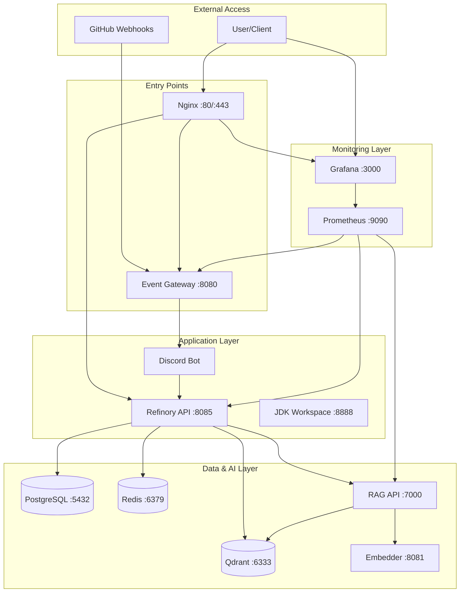

# Network Reconnaissance Report
**Generated:** Thu Nov 20 19:50:33 UTC 2025
**Infrastructure:** Strategic Khaos Sovereignty Architecture

---

## 🌐 Docker Networks

NAME      DRIVER    SCOPE
bridge    bridge    local
host      host      local
none      null      local

### Network Details

#### Network: bridge
```json
[
    {
        "Name": "bridge",
        "Id": "b2a0067a6b37c77905dbd2f1b79ed5d2c13bb4269564db92e06da3bfbf203fc3",
        "Created": "2025-11-20T19:45:56.295512567Z",
        "Scope": "local",
        "Driver": "bridge",
        "EnableIPv4": true,
        "EnableIPv6": false,
        "IPAM": {
            "Driver": "default",
            "Options": null,
            "Config": [
                {
                    "Subnet": "172.17.0.0/16",
                    "Gateway": "172.17.0.1"
                }
            ]
        },
        "Internal": false,
        "Attachable": false,
        "Ingress": false,
        "ConfigFrom": {
            "Network": ""
        },
        "ConfigOnly": false,
        "Containers": {},
        "Options": {
            "com.docker.network.bridge.default_bridge": "true",
            "com.docker.network.bridge.enable_icc": "true",
            "com.docker.network.bridge.enable_ip_masquerade": "true",
            "com.docker.network.bridge.host_binding_ipv4": "0.0.0.0",
            "com.docker.network.bridge.name": "docker0",
            "com.docker.network.driver.mtu": "1500"
        },
        "Labels": {}
    }
]
```

#### Network: host
```json
[
    {
        "Name": "host",
        "Id": "5214afbf7f466d14defa5b98352d0ccb264b45b1d40ff0aa0a912deb031b94b5",
        "Created": "2025-11-12T11:35:33.027515626Z",
        "Scope": "local",
        "Driver": "host",
        "EnableIPv4": true,
        "EnableIPv6": false,
        "IPAM": {
            "Driver": "default",
            "Options": null,
            "Config": null
        },
        "Internal": false,
        "Attachable": false,
        "Ingress": false,
        "ConfigFrom": {
            "Network": ""
        },
        "ConfigOnly": false,
        "Containers": {},
        "Options": {},
        "Labels": {}
    }
]
```

#### Network: none
```json
[
    {
        "Name": "none",
        "Id": "14de7c982d86292a110bfd0cd4ed6fe1ae873265cb8ef9f3993db6be55682cab",
        "Created": "2025-11-12T11:35:33.000981729Z",
        "Scope": "local",
        "Driver": "null",
        "EnableIPv4": true,
        "EnableIPv6": false,
        "IPAM": {
            "Driver": "default",
            "Options": null,
            "Config": null
        },
        "Internal": false,
        "Attachable": false,
        "Ingress": false,
        "ConfigFrom": {
            "Network": ""
        },
        "ConfigOnly": false,
        "Containers": {},
        "Options": {},
        "Labels": {}
    }
]
```

[✓] Docker networks scanned

## 🐳 Container Inventory

### Running Containers
```
NAMES     STATUS    PORTS     IMAGE
```

### All Containers (including stopped)
```
NAMES     STATUS    IMAGE
```

### Container Health Status


[✓] Container inventory complete

## 🔌 Port Mapping & Exposure

### Exposed Ports by Container

### Active Network Listeners
```
tcp        0      0 127.0.0.54:53           0.0.0.0:*               LISTEN     
tcp        0      0 127.0.0.53:53           0.0.0.0:*               LISTEN     
tcp        0      0 0.0.0.0:22              0.0.0.0:*               LISTEN     
tcp6       0      0 :::2301                 :::*                    LISTEN     
tcp6       0      0 :::22                   :::*                    LISTEN     
tcp6       0      0 :::33253                :::*                    LISTEN     
tcp6       0      0 :::37973                :::*                    LISTEN     
```

[✓] Port scanning complete

## 🏥 Service Health Checks

| Service | Endpoint | Status | Response Time |
|---------|----------|--------|---------------|
| PostgreSQL | tcp://localhost:5432 | ❌ DOWN | - |
| Qdrant (Main) | http://localhost:6333/healthz | ❌ DOWN | - |
| Event Gateway | http://localhost:8080/health | ❌ DOWN | - |
| Qdrant (Recon) | http://localhost:6333/health | ❌ DOWN | - |
| Prometheus | http://localhost:9090/-/healthy | ❌ DOWN | - |
| RAG Retriever | http://localhost:7000/health | ❌ DOWN | - |
| Embedder | http://localhost:8081/health | ❌ DOWN | - |
| Redis | tcp://localhost:6379 | ❌ DOWN | - |
| Grafana | http://localhost:3000/api/health | ❌ DOWN | - |
| Refinory API | http://localhost:8085/health | ❌ DOWN | - |

[✓] Service health checks complete

## 📦 Docker Compose Stack Analysis

### Discovered Compose Files

#### ./docker-compose-scaffold.yml
**Services defined:**
```yaml
- vault
- prometheus
- grafana
- loki
```
**Networks:**
```yaml
No networks defined
```
**Status:**
⚠️ Stack is not running or partially running

#### ./docker-compose.alignment.yml
**Services defined:**
```yaml
- alignment-monitor
```
**Networks:**
```yaml
- cloudos-network
```
**Status:**
⚠️ Stack is not running or partially running

#### ./docker-compose.obs.yml
**Services defined:**
```yaml
# ── Secrets & Authentication ─────────────────────────────────────────
- vault
# ── Redis Cache & Message Queue ──────────────────────────────────────
- redis
# ── Vector Database for AI/ML ─────────────────────────────────────────
- qdrant
# ── Metrics Collection ────────────────────────────────────────────────
- prometheus
# ── Visualization & Dashboards ────────────────────────────────────────
- grafana
# ── Log Aggregation ───────────────────────────────────────────────────
- loki
# ── Log Shipping ──────────────────────────────────────────────────────
- promtail
# ── Reverse Proxy & TLS ───────────────────────────────────────────────
- traefik
# ── PostgreSQL for Refinory ───────────────────────────────────────────
- postgres
# ── Temporal Workflow Engine ──────────────────────────────────────────
- temporal
# ── Application Performance Monitoring ────────────────────────────────
- jaeger
```
**Networks:**
```yaml
- obs_network
- recon_network
```
**Status:**
⚠️ Stack is not running or partially running

#### ./docker-compose-cloudos.yml
**Services defined:**
```yaml
# Reverse Proxy & Load Balancer
- traefik
# Cloud IDE (VS Code Server)
- desktop
# Web Terminal
- terminal
# AI SME API (Refinory)
- api
# Identity & Access Management
- keycloak
# Chat Server (Matrix Synapse)
- synapse
# Chat UI (Element Web)
- element
# Object Storage (MinIO)
- minio
# Vector Database
- qdrant
# Database
- postgres
# Cache & Message Broker
- redis
# Monitoring - Prometheus
- prometheus
# Monitoring - Grafana
- grafana
```
**Networks:**
```yaml
- cloudos_network
```
**Status:**
⚠️ Stack is not running or partially running

#### ./docker-compose.yml
**Services defined:**
```yaml
# Core Infrastructure
- postgres
- redis
# Vector Database
- qdrant
# Monitoring Stack  
- prometheus
- grafana
# Discord Bot & Event Gateway
- discord-bot
- event-gateway
# Refinory AI Orchestrator
- refinory-api
# JDK Workspace (OpenJDK 21/25 with Maven & Gradle)
- jdk-workspace
# Nginx Reverse Proxy
- nginx
```
**Networks:**
```yaml
- strategickhaos_network
```
**Status:**
⚠️ Stack is not running or partially running

#### ./docker-compose-recon.yml
**Services defined:**
```yaml
# Vector Database
- qdrant
# Embedding Service
- embedder
# Repository Ingestor
- ingestor
# RAG Retriever API
- retriever
```
**Networks:**
```yaml
- reconnet
```
**Status:**
⚠️ Stack is not running or partially running

[✓] Docker Compose analysis complete

## ⚙️ Environment Configuration

### Environment Variables (.env found)

**Configuration Summary:**
- Total variables: 35
- Discord config: 4
- GitHub config: 3
- Database config: 0
0
- API keys: 9

**Categories Present:**
- ALERTS_CHANNEL*: 1 variables
- ANTHROPIC_API*: 1 variables
- BIG_TEAM_COMMS*: 1 variables
- BIG_TECH_AUTOMATION*: 1 variables
- CH_AGENTS*: 1 variables
- CH_ALERTS*: 1 variables
- CH_CLUSTER_STATUS*: 1 variables
- CH_DEPLOYMENTS*: 1 variables
- CH_DEV_FEED*: 1 variables
- CH_INFERENCE*: 1 variables
- CH_PRS*: 1 variables
- CONTROL_PLANE_ACTIVATION*: 1 variables
- CROSS_STACK*: 1 variables
- DEPLOYMENTS_CHANNEL*: 1 variables
- DISCORD*: 4 variables
- DISCORD_GUILD*: 1 variables
- DISCORD_PR_CHANNEL*: 1 variables
- DISCORD_WEBHOOK*: 1 variables
- ENV*: 1 variables
- EVENTS_HMAC*: 1 variables
- GITHUB_APP*: 2 variables
- GITHUB_APP_PRIVATE_KEY*: 1 variables
- GITHUB_WEBHOOK*: 1 variables
- GRAFANA*: 1 variables
- HMAC*: 1 variables
- JWT*: 1 variables
- LOG*: 1 variables
- OPENAI_API*: 1 variables
- PORT*: 1 variables
- PRS_CHANNEL*: 1 variables
- SOVEREIGNTY*: 1 variables
- VAULT*: 3 variables
- VAULT_ROOT*: 1 variables
- XAI_API*: 1 variables

[✓] Environment configuration analyzed
### Example Configuration Available
✅ .env.example found for reference

## 📋 Infrastructure Requirements Check

### Required Tools & Services

| Tool | Status | Version |
|------|--------|---------|
| Docker | ✅ Installed | 28.0.4 |
| Docker Compose | ✅ Installed | 2.38.2 |
| Node.js | ✅ Installed | v20.19.5 |
| npm | ✅ Installed | 10.8.2 |
| Python 3 | ✅ Installed | 3.12.3 |
| curl | ✅ Installed | 8.5.0 |
| jq | ✅ Installed | 1.7 |
| yq | ✅ Installed | 4.48.1 |

[✓] Requirements check complete

## 🗺️ Network Topology



[✓] Network topology generated

## 💾 Resource Usage Analysis

### Container Resource Usage
```
NAME      CPU %     MEM USAGE / LIMIT   NET I/O   BLOCK I/O
```

### Docker Volume Usage
```
Images space usage:

REPOSITORY   TAG       IMAGE ID   CREATED   SIZE      SHARED SIZE   UNIQUE SIZE   CONTAINERS

Containers space usage:

CONTAINER ID   IMAGE     COMMAND   LOCAL VOLUMES   SIZE      CREATED   STATUS    NAMES

Local Volumes space usage:

VOLUME NAME   LINKS     SIZE

Build cache usage: 0B

CACHE ID   CACHE TYPE   SIZE      CREATED   LAST USED   USAGE     SHARED
```

[✓] Resource analysis complete

## 🔒 Security Analysis

### Exposed Ports Security Review

**Port Exposure Analysis:**

[✓] No dangerous port exposures on 0.0.0.0

**Privileged Containers:**
```
None found
```

**Host Network Mode:**
```
None found
```

### Environment Security

- Found 12 potential secrets in .env
[⚠] ⚠️ Found weak/default passwords in .env

[✓] Security scan complete

## 💡 Recommendations & Action Items

### Infrastructure Recommendations

1. ⚠️ **RECON Stack Not Running**
   - Start with: `./launch-recon.sh start`
   - This enables RAG-powered repository intelligence

2. ⚠️ **Discord Bot Not Running**
   - Check .env configuration for DISCORD_TOKEN
   - Start with: `docker compose up -d discord-bot`

3. ℹ️ **Monitoring Stack Not Running**
   - Consider starting Grafana/Prometheus for observability
   - Start with: `docker compose up -d grafana prometheus`

### Security Recommendations

1. ✓ Review port exposures (especially 0.0.0.0 bindings)
2. ✓ Ensure .env is in .gitignore
3. ✓ Rotate any default/weak passwords
4. ✓ Enable container resource limits
5. ✓ Implement network segmentation with Docker networks

### Performance Recommendations

1. ✓ Monitor resource usage with `docker stats`
2. ✓ Consider setting memory/CPU limits for containers
3. ✓ Use Docker volumes for persistence
4. ✓ Enable healthchecks for all services
5. ✓ Implement log rotation

[✓] Recommendations generated

## 📊 Executive Summary

### Infrastructure Overview

- **Running Containers:** 0 / 0
- **Docker Networks:** 3
- **Report Generated:** Thu Nov 20 19:50:37 UTC 2025
- **Report Location:** `recon/reports/network_scan_20251120_195033/`

### Key Findings

⚠️ No containers are currently running

### Quick Actions

```bash
# View full report
cat recon/reports/network_scan_20251120_195033/recon_report.md

# Start RECON stack
./launch-recon.sh start

# Check service health
docker compose ps

# View logs
docker compose logs -f [service-name]
```

[✓] Executive summary complete

---

_Report generated by Strategic Khaos Network Reconnaissance v1.0_

