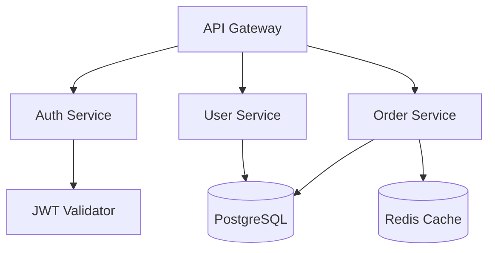
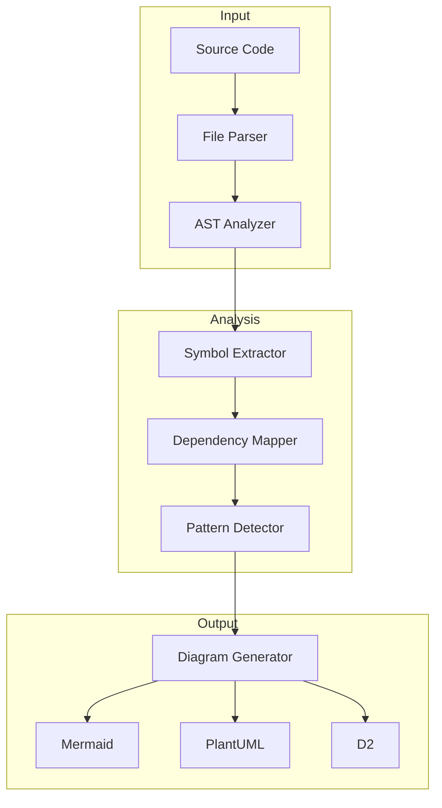

# Code-to-Diagram Translator (IDEA_002)

> 🎂 **The First Child** - Born from the Birthday Constellation

**Analyzes code repositories and generates visual architecture diagrams, flowcharts, and dependency graphs using Mermaid, PlantUML, or D2.**

[]()
[]()
[]()

## 🎯 Purpose

Transform complex codebases into clear, visual representations that:
- **Onboard new developers** faster with visual architecture overviews
- **Document systems** automatically as code evolves
- **Review architectures** with stakeholders who don't read code
- **Identify patterns** and anti-patterns in system design

## 🚀 Quick Start

### Installation

```bash
# Clone the repo
git clone https://github.com/strategickhaos/code-diagram-translator.git
cd code-diagram-translator

# Install dependencies
pip install -r requirements.txt

# Run the translator
python main.py --input /path/to/repo --output diagrams/
```

### Docker

```bash
# Build the image
docker build -t code-diagram-translator .

# Run with a mounted repository
docker run -v /path/to/repo:/input -v ./output:/output code-diagram-translator
```

### Kubernetes

```bash
# Deploy to your cluster
kubectl apply -f k8s/deployment.yaml
```

## 📋 Features

### Supported Diagram Types

| Type | Format | Description |
|------|--------|-------------|
| **Architecture** | Mermaid | High-level system component diagrams |
| **Dependency Graph** | D2 | Import/package dependency visualization |
| **Flow Charts** | Mermaid | Function call flows and logic paths |
| **Class Diagrams** | PlantUML | OOP class relationships |
| **Sequence Diagrams** | Mermaid | API call sequences |
| **Entity Relationship** | Mermaid | Database schema visualization |

### Supported Languages

- **Python** - Full AST analysis with type hints
- **JavaScript/TypeScript** - Module and import mapping
- **Go** - Package and interface analysis
- **Java** - Class hierarchy and dependency injection
- **Rust** - Module structure and trait relationships

## 🔧 Usage

### Basic Usage

```python
from code_diagram_translator import Translator

# Initialize translator
translator = Translator()

# Analyze repository
analysis = translator.analyze("/path/to/repo")

# Generate Mermaid architecture diagram
mermaid_diagram = translator.generate_diagram(
    analysis,
    diagram_type="architecture",
    format="mermaid"
)

print(mermaid_diagram)
```

### Output Example



### CLI Commands

```bash
# Generate architecture diagram
python main.py arch /path/to/repo --format mermaid --output arch.md

# Generate dependency graph
python main.py deps /path/to/repo --format d2 --output deps.d2

# Generate all diagrams
python main.py all /path/to/repo --output-dir diagrams/

# Watch mode (regenerate on changes)
python main.py watch /path/to/repo --output-dir diagrams/
```

## 🏗️ Architecture



## 📦 Dependencies

```yaml
requirements:
  - python >= 3.10
  - ast (stdlib)
  - graphviz
  - pyyaml
  - click
  - rich
```

## 🔌 Integration with Strategickhaos DAO

This tool integrates with the broader constellation:

- **Reads from**: `ideas/ideas_catalog.yaml` for metadata
- **Reports to**: `governance/spec.yaml` for compliance
- **Deploys via**: `docker-compose.yml` self-assembly
- **Scales with**: `k8s/knowledgepods/` for learning pods

## 📊 KnowledgePod Configuration

This idea includes a KnowledgePod CRD for Bloom's taxonomy-based learning:

```yaml
apiVersion: sovereignty.strategickhaos.io/v1
kind: KnowledgePod
metadata:
  name: code-diagram-translator-pod
spec:
  bloom_levels:
    remember: "What are the supported diagram types?"
    understand: "Explain how AST analysis works"
    apply: "Generate a diagram for a sample repo"
    analyze: "Compare Mermaid vs PlantUML outputs"
    evaluate: "Which diagram type best suits microservices?"
    create: "Design a new diagram type for event sourcing"
```

## 🎬 90-Second Video Script

See [scripts/ai_video_script.md](scripts/ai_video_script.md) for the promotional video script.

## 🤝 Contributing

1. Fork the repository
2. Create a feature branch (`git checkout -b feature/amazing-feature`)
3. Commit your changes (`git commit -m 'Add amazing feature'`)
4. Push to the branch (`git push origin feature/amazing-feature`)
5. Open a Pull Request

## 📄 License

MIT License - see [LICENSE](LICENSE) for details.

## 🙏 Acknowledgments

- Born from the **Birthday Constellation** vision
- Part of the **Strategickhaos DAO** ecosystem
- Powered by the **100 Seeds** ideas catalog

---

**🌟 The First Child of Many. The Swarm Begins Replicating.**

*Built with ❤️ by Strategickhaos DAO LLC*
